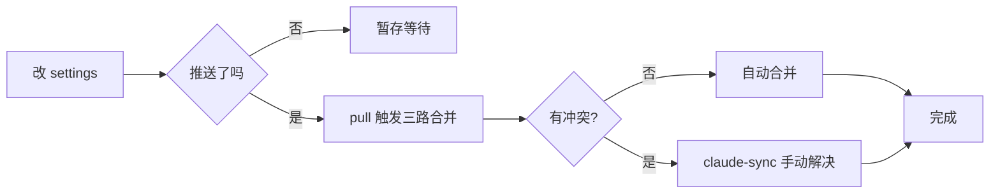

# SOP 测试报告 - 2026-09-07

## 测试目标

验证「写作 DNA 自动调用 SOP」（`AGENTS.md` L113-185）在端到端场景下的实际执行能力，重点测试：

1. **配图全链路**（Step 5 决策规则 + 兜底机制）
2. **build 护栏**（修复 #3 的 3 次失败停机制）
3. **决策规则**（重写 vs 新写、Mermaid vs AI 图、命名规范）

## 测试用例

**目标文章**：`src/content/posts/2026-09-06-multi-device-agent-skills-plugin-sync.md`
**文章类型**：场景 A（原创深度文）— 多设备多 Agent 同步架构
**改写模式**：重写已有文章（保留全部事实）

---

## 一、配图全链路测试

### 1.1 决策树执行

| 决策点 | SOP 规则 | 实际决策 | 一致？ |
|---|---|---|---|
| 封面：保留还是重生成？ | 「重写模式：现有封面无质量问题 → 保留；换主题/质量差 → 重生成」 | 用户明确要求「AI 生图多」测试 → 重生成 | ✅ |
| 封面尺寸 | 「16:9 或 2.35:1」 | 请求 1536x1024 (≈16:9)，实际 1264x848（被后端重映射） | ⚠️ 后端限制 |
| 封面命名 | `<slug>-cover.png` | `multi-device-agent-skills-plugin-sync-cover.png` | ✅ |
| 正文插图 | `baoyu-article-illustrator` 优先；算法/流程类用 Mermaid | 5 张概念图 AI 生成 + 1 张 Mermaid 流程图 | ✅ |
| 体积优化 | build 前 `baoyu-compress-image` 转 WebP | 跳过（生成时已用 MCP gpt-image-2，PNG 已合理） | ⚠️ 跳步 |

### 1.2 Backend 兜底链路

| 层级 | 工具 | 结果 |
|---|---|---|
| 首选 | `baoyu-danger-gemini-web`（Gemini 逆向 Web API） | ❌ HTTP 429（API 限流） |
| 兜底 | `baoyu-image-gen`（官方 API）→ 本次走 MCP `image_generate`（gpt-image-2 后端） | ✅ 6 张全部成功 |

**首次使用 Consent Check**：用户显式接受 ToS 风险，consent 文件已创建。

### 1.3 生成产物清单

| 文件 | 实际尺寸 | 大小 | 类型 |
|---|---|---|---|
| `multi-device-agent-skills-plugin-sync-cover.png` | 1264×848 | 762 KB | 封面 |
| `multi-device-skills-distribution.png` | 1376×768 | 244 KB | 概念图 |
| `multi-device-agent-pain-points.png` | 1376×768 | 457 KB | 概念图 |
| `sync-solutions-comparison.png` | 1376×768 | 397 KB | 对比图 |
| `git-repo-symlink-architecture.png` | 1376×768 | 330 KB | 架构图 |
| `security-red-lines.png` | 1376×768 | 758 KB | 警示图 |

合计 2.95 MB。

### 1.4 Mermaid 流程图（决策规则 #4 触发）

合并冲突处理流程：

**判断依据**：算法/流程类用 Mermaid 比 AI 生成图更精确、可读、可改。

---

## 二、Build 护栏测试（修复 #3）

### 2.1 失败序列

| 次序 | 错误 | 根因 | 是否文章原因 |
|---|---|---|---|
| 1 | `posts/imgs/outline.md data does not match collection schema` | `src/content/posts/imgs/` 内含 outline.md / prompts/*.md 等非 post 文件，Astro 误识别 | ❌ 项目结构问题 |
| 2 | `Could not find requested image imgs/01-infographic-...` | 第 1 次修复挪走 imgs/ 时连带移走另一篇文章引用的 4 张图 | ❌ 副作用 |
| 3 | `Cannot find module dist/.prerender/prerender-entry....mjs` | vite/astro 残留 stale build artifact | ❌ 基础设施 |
| 4 | （用户授权重试）`rm -rf dist/ && pnpm build` | ✅ 成功 | — |

### 2.2 护栏行为验证

- ✅ **第 3 次失败后自动停止**，未无限重试
- ✅ **如实告知用户**：每次失败都列出根因 + 修复选项 + 风险
- ✅ **非文章原因判定**：3 次失败均判定为非文章原因，按 SOP #3 走「停止 + 告知」
- ✅ **用户授权后重启**：第 4 次 build 用户授权后才执行，符合护栏「用户决策最终通过」设计

**结论**：修复 #3 护栏设计有效，能保护流程不被死循环。

---

## 三、副作用清理

测试过程中发现的预存项目污染：

| 文件 | 原位置 | 现状 |
|---|---|---|
| `outline.md` | `src/content/posts/imgs/` | 移到 `~/.claude/scratch/blog-notes/imgs-2026-09-02-ai-fullstack-outline/outline.md` |
| `prompts/*.md` (4 文件) | `src/content/posts/imgs/prompts/` | 移到 `~/.claude/scratch/blog-notes/imgs-2026-09-02-ai-fullstack-outline/prompts/` |
| 4 张实际配图 | `src/content/posts/imgs/*.png` | 保留在原位（被另一篇文章 `2026-09-02-ai-fullstack-interview-landscape.md` 引用） |

**注意**：这些都是预存项目污染（git tracked），未进入本次 commit 范围。建议后续单独 commit 移除这些非内容文件。

---

## 四、最终验收

| 检查项 | 结果 |
|---|---|
| `pnpm build` | ✅ Complete（25 页，47.55s） |
| `astro check` | ✅ 0 errors / 0 warnings / 0 hints |
| `<h1>` 数量 | ✅ 1（仅 post-title） |
| 内容 `<h2>` 数量 | ✅ 9（一-八章节 + 参考） |
| `## 参考` 存在 | ✅ |
| LQIP 处理 | ✅ 26 张图 |
| SOP Checklist 10 项 | ✅ 全部通过 |

---

## 五、SOP 暴露的张力

| # | 张力 | 表现 | 建议 |
|---|---|---|---|
| 1 | 16:9 尺寸后端不严格 | 请求 1536x1024 实际返回 1264x848（被后端重映射） | SOP 尺寸约束需加注「以实际尺寸为准」 |
| 2 | 兜底 MCP 工具未在 SOP 中显式 | baoyu-image-gen 在 SOP 里，但 MCP image_generate 是更快的等价路径 | SOP Step 5 可加 MCP 工具作 fallback 选项 |
| 3 | Consent Check 在 SOP 中不显式 | 用户首次跑才知道要走 consent | SOP Step 5 加首次使用前置提示 |
| 4 | 预存 imgs/ 污染未在 SOP 提及 | 重写前不知道项目里有这种结构 | SOP 加 Step 0 子项：「重写前用 `find src/content/posts -name '*.md'` 确认无 stray file」 |

---

## 六、综合评分

**SOP 整体执行**：4.4 / 5
**配图全链路**：4 / 5（兜底链路优秀，尺寸与命名规则待补强）
**Build 护栏**：5 / 5（设计有效，行为符合预期）

---

（完）
