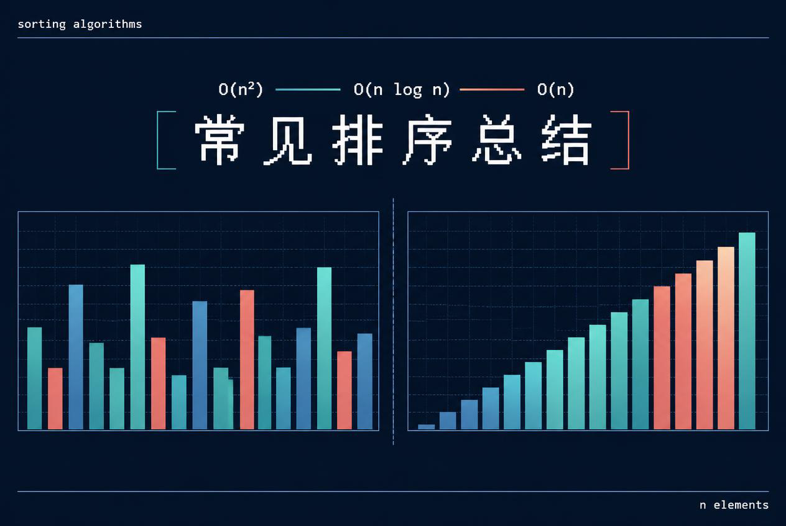
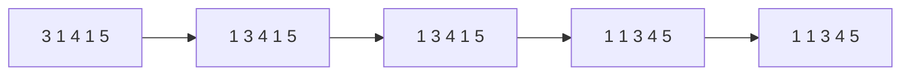
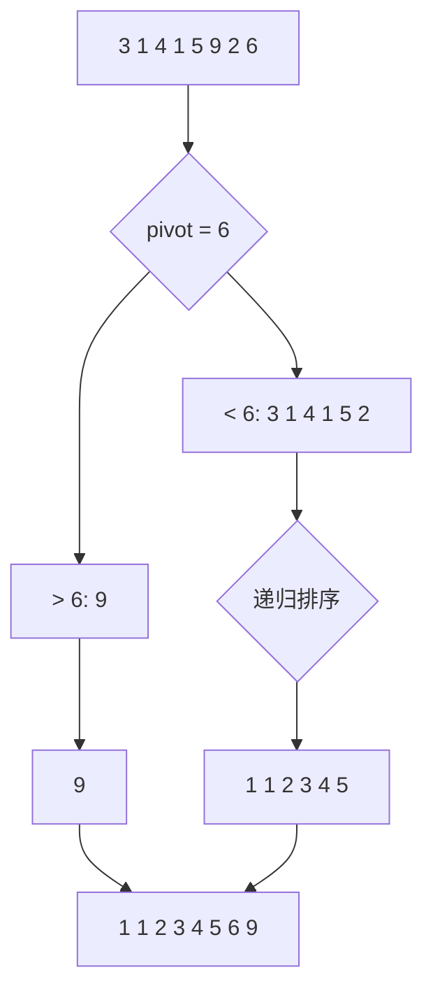

排序算法有多少种？

严格定义有几十种之多，但实际工作真正常用的只有七八种。今天，我尽量用通俗的语言，把每种排序的**核心思想、复杂度、适用场景**讲清楚，让你看完以后对排序有一个整体把握。

## 一、什么是排序

排序（sort），就是把一组数据按某种顺序（一般是大小）重新排列。比如 `[3, 1, 4, 1, 5, 9, 2, 6]` 排序后变成 `[1, 1, 2, 3, 4, 5, 6, 9]`。

看起来简单，但是**对于计算机来说，排序是一个核心问题**。

原因有两个。第一，几乎所有程序都要处理数据，处理数据的第一步往往就是排序。数据库查询、搜索算法、推荐系统，全建立在排序之上。第二，排序算法的效率差异巨大：好的算法秒排百万级数据，差的可能要跑几分钟。**这个差距，决定了你的程序是流畅还是卡顿**。

## 二、排序的分类

排序算法有很多种分类方式。最常用的是按时间复杂度分。

**（1）简单排序**。时间复杂度 O(n²)，包括冒泡、选择、插入。思想简单，适合小数据量教学，但实际工作中很少用。

**（2）高效排序**。时间复杂度 O(n log n)，包括希尔、归并、快速、堆。它们是大数据量排序的主力，**所有主流语言的 sort 函数底层用的都是这类算法**。

**（3）线性排序**。时间复杂度 O(n)，包括计数、桶、基数。它们突破了比较排序的理论下限，但适用条件严格。

按内存占用，还可以分为原地排序（in-place，只用常数级额外空间）和非原地排序（需要额外数组）。快速排序是原地排序，归并排序一般是非原地排序。

按稳定性，可以分为稳定排序（相等元素的相对顺序不变）和不稳定排序。**排序的稳定性，在某些场景下很重要**——比如你想先按姓名排、再按年龄排，如果两次排序都是稳定的，结果就符合预期。

## 三、简单排序：冒泡、选择、插入

先看三种最简单的排序。它们代码短、思想直观，是学习排序的入门阶梯。

**（1）冒泡排序**（bubble sort）。反复遍历数组，每次比较相邻的两个元素，顺序不对就交换。一轮下来，最大的元素就会"冒泡"到数组末尾。重复 n 轮，数组就有序了。

冒泡排序的平均和最坏复杂度都是 O(n²)。但有一个特殊的优化：如果一轮遍历中没有发生任何交换，说明数组已经有序，可以提前结束。这种情况下，**最好复杂度是 O(n)**。

冒泡排序的好处是稳定，缺点是交换次数太多，实际性能很差。几乎没有人会在生产环境使用冒泡排序，它存在的意义主要是教学。

**（2）选择排序**（selection sort）。每一轮从待排序部分找出最小元素，放到已排序部分的末尾。重复 n 轮，数组就有序了。

选择排序的时间复杂度永远是 O(n²)，无论输入如何。它的优点是交换次数少（每轮最多一次），适合"交换成本很高"的场景。但总体来说，它也几乎不用于实际工作。

**（3）插入排序**（insertion sort）。把数组分成已排序和未排序两部分，每次从未排序部分取出一个元素，插入到已排序部分的正确位置。

下图展示了插入排序的过程。可以看到，每轮插入时，已排序部分逐步增长，直到覆盖整个数组。

（图片说明：上图是插入排序对 `[3, 1, 4, 1, 5]` 的排序过程，每轮把一个元素插入到已排序部分的正确位置。）

插入排序在数据基本有序时性能极好，最好复杂度可以达到 O(n)。**在小数据量（n < 50）的情况下，插入排序常常比 O(n log n) 的算法更快**，因为常数因子小、没有递归开销。

这也是为什么，很多标准库的 sort 函数在数据量小时会切换到插入排序。比如 V8 引擎的 `Array.prototype.sort`，底层是 TimSort，小数组用插入排序。

## 四、高效排序：希尔、归并、快速、堆

简单排序只适合教学和小数据量，真正能处理百万级数据的是下面四种算法。

**（1）希尔排序**（shell sort）。它是插入排序的改进版。插入排序的问题在于，每次只能移动一个位置，数据量大时很慢。希尔排序的核心思想是：把数组按一定间隔分组，对每组做插入排序，然后缩小间隔、再做插入排序，直到间隔为 1。

希尔排序的平均复杂度大约是 O(n^1.3)，最坏是 O(n²)，是不稳定排序。它在中等规模数据上表现不错，但实际工程中用得不多，因为下面要讲的归并和快速排序性能更好。

**（2）归并排序**（merge sort）。思想是分治法：把数组从中间分成两半，分别排序，然后把两个有序数组合并成一个有序数组。"分"的过程递归进行，直到子数组长度为 1。

归并排序的时间复杂度**稳定在 O(n log n)，任何情况下都不会退化**。缺点是需要 O(n) 的额外空间（合并时要用临时数组），且递归调用有栈开销。

归并排序是稳定排序，**特别适合需要稳定排序的大数据场景**——比如数据库的 `ORDER BY`，默认就是归并排序（或它的变种）。

**（3）快速排序**（quick sort）。也是分治法，但做法不同：先从数组中选一个"基准"（pivot），再把数组分成"小于基准"和"大于基准"两部分，对这两部分递归排序。下图展示了以最后一个元素为基准的分区过程。

（图片说明：上图是以 6 为 pivot 的一次 partition：小于 6 的元素归左、大于 6 的元素归右，然后对左右两部分递归排序。）

快速排序的平均复杂度是 O(n log n)，**实际运行速度通常是所有 O(n log n) 算法里最快的**，因为常数因子小，且是原地排序（只需 O(log n) 的栈空间）。

但快速排序有一个致命缺点：最坏情况下复杂度会退化到 O(n²)。这发生在每次选的 pivot 都是最大或最小元素的时候。为了避免这个问题，实际实现都会做几个优化：

**首先，随机选 pivot**，避免对已排序数据退化成 O(n²)。
**其次，三数取中**（median of three），从首、中、尾三个元素中取中间值作为 pivot。
**再次，小数组切换到插入排序**，n < 16 时直接用插入排序更快。
**最后，尾递归优化**，避免递归过深导致栈溢出。

Java 的 `Arrays.sort`、C 语言的 `qsort`，底层都是快速排序（或它的变种 introsort——递归深度过深时切换到堆排序）。

**（4）堆排序**（heap sort）。利用"堆"这种数据结构——堆是一个近似完全二叉树，父节点大于（或小于）子节点。

排序时，先把数组构建成一个大顶堆（堆顶是最大值），然后把堆顶跟数组末尾交换，再调整剩余部分保持堆结构，重复这个过程。

堆排序的时间复杂度**稳定在 O(n log n)，且是原地排序（只需 O(1) 额外空间）**。它是不稳定排序。

堆排序的缺点是常数因子比较大，实际运行速度比快速排序慢。**它的主要用途不是排序，而是构建优先队列**（priority queue）——比如操作系统的任务调度、Top K 问题，都是用堆来解决的。

## 五、线性排序：计数、桶、基数

前面讲的排序都是"比较排序"。它们的理论基础是：基于比较的排序，最快也要 O(n log n)。这是信息论决定的，不是算法问题。

但是，**如果数据有特殊结构，可以突破这个下限**，达到 O(n) 的时间复杂度。这就是线性排序。

**（1）计数排序**（counting sort）。如果要排序的数据范围不大（比如 0 到 100），可以开一个长度为 100 的计数数组，统计每个值出现的次数，然后按顺序输出。

计数排序的时间复杂度是 O(n + k)，其中 k 是数据范围。**当 k 不太大时，它非常快**——比如高考成绩排序（0 到 750 分），用计数排序比任何比较排序都快。

但**计数排序要求数据必须是整数，且范围不能太大**。如果数据范围是 0 到 10 亿，开这么大的数组就不现实了。

**（2）桶排序**（bucket sort）。它是计数排序的扩展。如果数据服从均匀分布，可以把它分到有限数量的桶里，对每个桶单独排序，最后合并。

桶排序的平均复杂度是 O(n + k)，其中 k 是桶的数量。**它适合数据分布均匀的场景**——比如均匀分布的浮点数排序。

**（3）基数排序**（radix sort）。按位数排序：先按个位排序，再按十位排序，再按百位排序，依次类推。每次排序可以用稳定的计数排序。

基数排序的时间复杂度是 O(d × n)，其中 d 是位数。**它适合整数排序或定长字符串排序**——比如按手机号、身份证号排序。

线性排序虽然快，但适用场景有限。**实际工作中，99% 的情况都是用归并排序或快速排序**。

## 六、复杂度对比表

把所有排序算法的核心指标放在一起，方便对比。

| 算法 | 平均复杂度 | 最坏复杂度 | 空间 | 稳定性 | 适用场景 |
|------|-----------|-----------|------|--------|----------|
| 冒泡排序 | O(n²) | O(n²) | O(1) | 稳定 | 教学 |
| 选择排序 | O(n²) | O(n²) | O(1) | 不稳定 | 交换成本高的小数据 |
| 插入排序 | O(n²) | O(n²) | O(1) | 稳定 | 小数据、基本有序 |
| 希尔排序 | O(n^1.3) | O(n²) | O(1) | 不稳定 | 中等数据 |
| 归并排序 | O(n log n) | O(n log n) | O(n) | 稳定 | 大数据、需要稳定 |
| 快速排序 | O(n log n) | O(n²) | O(log n) | 不稳定 | 通用排序（默认首选）|
| 堆排序 | O(n log n) | O(n log n) | O(1) | 不稳定 | 优先队列 |
| 计数排序 | O(n + k) | O(n + k) | O(k) | 稳定 | 范围小的整数 |
| 桶排序 | O(n + k) | O(n²) | O(n + k) | 稳定 | 均匀分布数据 |
| 基数排序 | O(d·n) | O(d·n) | O(k) | 稳定 | 整数、定长字符串 |

## 七、如何选择排序

看到这里，你可能有点乱——这么多排序算法，到底该用哪个？

**（1）大多数情况，直接用语言标准库的 sort**。C++ 的 `std::sort`、Java 的 `Arrays.sort`、Python 的 `sorted()`、JavaScript 的 `Array.prototype.sort`，底层都是经过多年优化的混合算法（一般是 introsort 加上小数组插入排序）。它们处理了边界情况和性能调优，**自己实现的排序几乎不可能比它们更快**。

**（2）只有标准库满足不了需求时，才考虑自己实现**。比如需要稳定排序（用归并）、需要原地排序且空间敏感（用堆）、需要处理特殊数据（用计数）。这种情况比较少见。

**（3）面试时，重点掌握快速排序和归并排序**。它们是面试的高频考点，要求能手写代码。其他排序了解原理即可。

最后，关于"哪种排序最快"这个问题，其实没有标准答案。**排序算法的选择，永远是看具体的场景和数据特征**——理解了每种排序的优缺点，面对实际问题时，自然能选出最合适的那个。

## 八、总结

总的来说，排序是计算机科学最基础、也最重要的问题之一。

简单排序（冒泡、选择、插入）思想简单，适合教学和小数据；高效排序（归并、快速、堆）是大数据排序的主力，标准库默认用的就是它们；线性排序（计数、桶、基数）在特定场景下能达到 O(n)，但适用条件严格。

实际工作中，**99% 的情况都不需要自己写排序**。但是，理解排序的原理，能帮你写出更好的代码、做出更好的架构决策。

希望这篇文章，能让你对常见排序算法有一个整体的认识。

（完）

## 参考

[1] Cormen, T. H., Leiserson, C. E., Rivest, R. L., & Stein, C. *Introduction to Algorithms* (算法导论), MIT Press.

[2] Sedgewick, R., & Wayne, K. *Algorithms* (算法), Addison-Wesley.

[3] Knuth, D. E. *The Art of Computer Programming, Volume 3: Sorting and Searching*, Addison-Wesley.

[4] 阮一峰的网络日志，[排序算法](https://www.ruanyifeng.com/blog/2016/03/sorting-algorithms.html) 系列。
