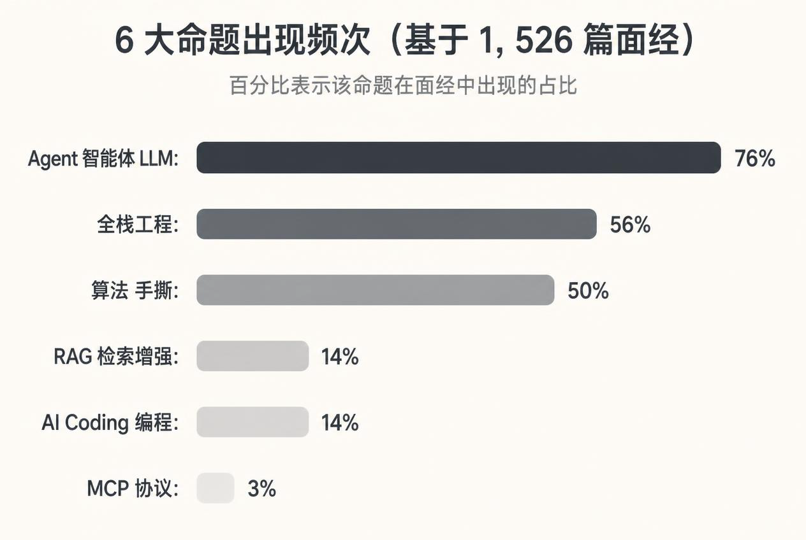
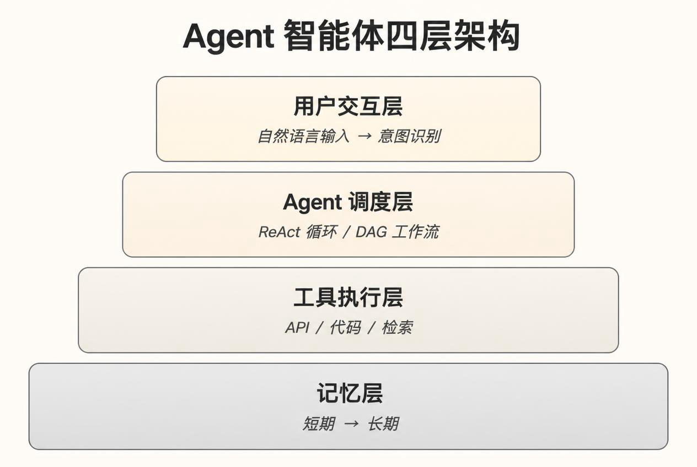
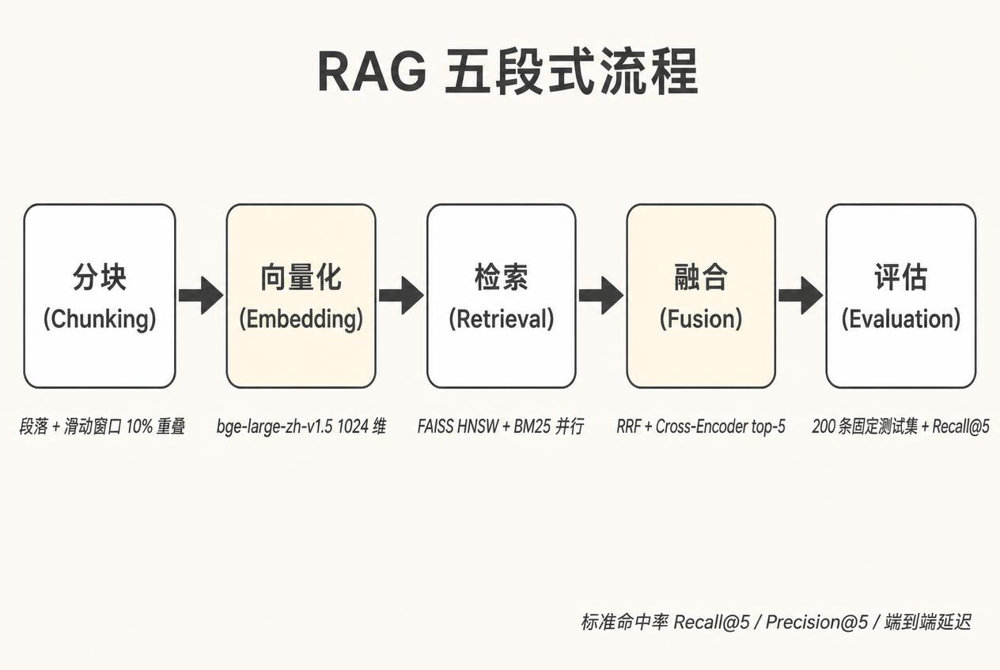
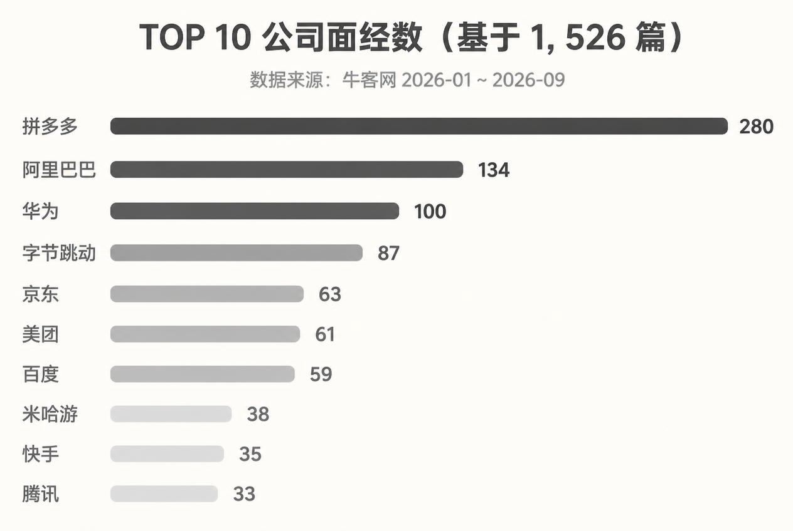

## 一、引言

最近秋招季，我用 ego-browser 和 curl 抓了 **1,526 篇 2026 年牛客 AI 全栈/Agent 面经**，覆盖 37 家公司。读完 1,500+ 篇文章 + 跑完关键词统计后，今天给你一份基于真实数据的"秋招在考什么"完整地图。

这跟之前我看到的大多数面经分析不一样——所有结论都用 1,526 篇的样本算出来，每条数据都标注样本量。

下面，我尽量用通俗的语言，把这份数据研究拆开给你看。所有数据都标了样本数，方便你核查。

## 二、整体画像

抓取概况：

| 指标 | 数值 |
|---|---|
| 样本总数 | 1,526 篇 |
| 覆盖公司 | 37 家 |
| 覆盖时段 | 2026-01 ~ 2026-09（**87% 集中在 8-9 月**）|
| 成功匹到至少一个命题 | 1,433 篇（93.9%）|
| 成功匹到公司 | 994 篇（65.1%）|

**6 大命题频次**（按 1,526 篇统计，一篇可匹多个命题）：

**（1）Agent / 智能体 / LLM**：1,156 篇（**75.8%**）—— 几乎必问
**（2）全栈工程**：856 篇（56.1%）—— 后端八股仍是基础门槛
**（3）算法 / 手撕**：757 篇（49.6%）—— 字节/阿里必考
**（4）RAG / 检索增强**：209 篇（13.7%）
**（5）AI Coding**：209 篇（13.7%）
**（6）MCP**：51 篇（3.3%）—— 新增方向，但增长快

最关键的变化是 **Agent 从亮点变成默认**。早期 RAG、LoRA 微调还是加分项，现在 76% 的面经都问 Agent。亮点已经从"会不会"转移到"范式选型 + 工程取舍"。

**TOP 10 公司面经数**（基于 1,526 篇统计）：

| 公司 | 面经数 | 主要命题 | 最常考点 |
|---|---|---|---|
| 拼多多 | 280（18.3%） | Agent 275 / 全栈 248 / 算法 237 | 大模型 231 / 算法 230 / agent 71 |
| 阿里巴巴 | 134（8.8%） | Agent 107 / 全栈 71 | agent 88 / 算法 29 / RAG 18 |
| 华为 | 100（6.6%） | Agent 78 / 算法 52 | 大模型 51 / 算法 34 |
| 字节跳动 | 87（5.7%） | Agent 73 / 算法 52 | agent 49 / 算法 33 / RAG 13 |
| 京东 | 63（4.1%） | **AI Coding 39** / 算法 36 | ai coding 38 / 算法 23 |
| 美团 | 61（4.0%） | **AI Coding 39** / Agent 33 | ai coding 39 / 算法 22 |
| 百度 | 59（3.9%） | Agent 46 / 全栈 32 | 大模型 23 / agent 21 |
| 米哈游 | 38（2.5%） | 全栈 30 / Agent 28 | 大模型 21 / 算法 10 |
| 快手 | 35（2.3%） | Agent 30 / 全栈 23 | agent 18 / 大模型 16 |
| 腾讯 | 33（2.2%） | Agent 29 / 全栈 17 | 大模型 19 / agent 11 |

**关键观察**：拼多多 280 篇一家独大（占 18.3%），Agent 在每家公司都最热；京东/美团最重视 AI Coding。

## 三、Agent 智能体（命题 1，76%）

Agent 是 2026 秋招最高频命题，1,156 篇面经涉及。

**高频考点**（按 1,156 篇统计）：

| 排名 | 考点 | 出现篇数 | 命中率 |
|---|---|---|---|
| 1 | 大模型 | 633 | 54.8% |
| 2 | agent | 550 | 47.6% |
| 3 | rag | 154 | 13.3% |
| 4 | llm | 59 | 5.1% |
| 5 | 智能体 | 58 | 5.0% |
| 6 | mcp | 50 | 4.3% |
| 7 | 上下文 | 46 | 4.0% |
| 8 | 记忆 | 37 | 3.2% |
| 9 | ReAct | 32 | 2.8% |
| 10 | langchain | 31 | 2.7% |

**公司分布**：

- 拼多多：280 篇里 275 涉及 Agent（98.2%）
- 阿里：107/134（79.9%）
- 字节：73/87（83.9%）

**回答框架**（综合 1,156 篇的高频回答模式）：

1. **范式层**：ReAct vs Workflow vs Plan-Execute 三种范式选型 + 适用场景
2. **框架层**：LangChain vs LangGraph vs 自研——重点是"为什么"
3. **记忆层**：短期（滑动窗口）+ 长期（向量存储）+ 摘要压缩
4. **工具层**：MCP 协议、参数校验、超时处理、错误恢复
5. **评估层**：固定测试集 + 端到端延迟 + 成本控制 + 回归验证

## 四、全栈工程（命题 2，56%）

全栈工程是后端八股的延伸，856 篇涉及。

**高频考点**：

| 排名 | 考点 | 出现篇数 |
|---|---|---|
| 1 | java | 118 |
| 2 | 并发 | 51 |
| 3 | python | 49 |
| 4 | 网络 | 41 |
| 5 | redis | 36 |
| 6 | 数据库 | 35 |
| 7 | 高并发 | 30 |
| 8 | mysql | 23 |
| 9 | 缓存 | 23 |
| 10 | 消息 | 22 |

**公司分布**：

- 拼多多：248 篇（88.6%），最重视
- 阿里：71 篇
- 字节：46 篇
- 蔚来：25 篇（89.3%）—— 蔚来特别重视全栈

**回答框架**（"战前-战中-战后"三层）：

- **战前（预防）**：Redis 集群/哨兵、持久化、主从复制
- **战中（容错）**：熔断降级、限流策略、MQ 暂存
- **战后（恢复）**：数据恢复、缓存预热、复盘改进

## 五、算法与数据结构（命题 3，50%）

算法在 757 篇面经里出现。

**高频考点**：

| 排名 | 考点 | 出现篇数 |
|---|---|---|
| 1 | 算法 | 539 |
| 2 | 栈 | 134 |
| 3 | 手撕 | 47 |
| 4 | 算法题 | 41 |
| 5 | 模拟 | 33 |
| 6 | 迭代 | 31 |
| 7 | 排序 | 27 |
| 8 | 堆 | 17 |
| 9 | 数组 | 16 |
| 10 | 树 | 14 |

**公司分布**：

- 拼多多：237/280（84.6%）—— **最考算法**
- 字节：52/87（59.8%）
- 华为：52/100（52.0%）

**准备策略**：
- LeetCode Medium 为主
- 栈、链表、二叉树、动态规划为重点
- 大模型核心手写（Multi-Head Attention）偶有

## 六、RAG 检索增强（命题 4，14%）

RAG 在 209 篇面经涉及。

**高频考点**：

| 排名 | 考点 | 出现篇数 |
|---|---|---|
| 1 | rag | 154 |
| 2 | 检索 | 49 |
| 3 | 知识库 | 46 |
| 4 | 向量 | 33 |
| 5 | 召回 | 25 |
| 6 | 切分 | 12 |
| 7 | 向量检索 | 12 |
| 8 | chunk | 10 |
| 9 | bm25 | 10 |
| 10 | 相似度 | 10 |

**典型公司**：阿里 18 篇（含 RAG 的 38%）、字节 13 篇（27%）

**回答框架**（"分块 -> 向量化 -> 检索 -> 融合 -> 评估"五段式）：

1. 分块策略：段落 + 滑动窗口重叠 10%
2. 向量化：选 bge-large-zh-v1.5，1024 维
3. 检索链路：FAISS HNSW + BM25 并行 + RRF 融合
4. 融合与重排序：Cross-Encoder 对 top-20 重排，取 top-5
5. 评估体系：200 条固定测试集 + Recall@5 / Precision@5 + 端到端延迟

## 七、AI Coding（命题 5，14%）

AI Coding 在 209 篇面经涉及。

**高频考点**：

| 排名 | 考点 | 出现篇数 |
|---|---|---|
| 1 | ai coding | 179 |
| 2 | claude code | 12 |
| 3 | codex | 12 |
| 4 | cursor | 5 |
| 5 | ai编程 | 4 |
| 6 | 编程助手 | 3 |
| 7 | 代码生成 | 3 |

**特别观察**：

- **京东 39/63（61.9%）**和**美团 39/61（63.9%）** AI Coding 占比最高
- 其他公司 AI Coding 是 Agent 下的子话题
- 这两家公司似乎有独立的"AI Coding 笔试/评估"

**回答框架**（"工具选择 -> 使用场景 -> 质量保障 -> 调试方法"四段式）：

1. 工具选择：Codex / Claude Code / Cursor
2. 使用场景：前端 / 后端 / 测试
3. 质量保障：单元测试 + 代码审查 + 人工验证
4. 调试方法：埋点 + 错误追踪 + 日志分析

## 八、MCP 模型上下文协议（命题 6，3.3%）

MCP 是新增方向，51 篇面经涉及。

**高频考点**：

| 排名 | 考点 | 出现篇数 |
|---|---|---|
| 1 | mcp | 50 |
| 2 | mcp 协议 | 2 |
| 3 | 工具注册 | 2 |
| 4 | mcp server | 1 |
| 5 | mcp 工具 | 1 |

虽然 3.3% 占比不高，但 MCP 是 2026 年新增的高频题——**8 个月前还几乎没人问**。准备策略：理解 MCP 协议（Resources / Prompts / Tools）、会写简单的 MCP Server、能跟 Function Calling 做对比。

## 九、TOP 10 公司备战重点对比

| 公司 | 面经数 | 重点命题 | 备考优先级 |
|---|---|---|---|
| 拼多多 | 280 | Agent / 全栈 / 算法（246+） | Agent 工程 + 高并发后端 |
| 阿里 | 134 | Agent / RAG（18）/ 全栈 | Agent 范式 + RAG 系统设计 |
| 华为 | 100 | Agent / 算法 | 算法 + 智能体 |
| 字节 | 87 | Agent / 算法 / RAG（13） | 算法硬核 + Agent 深挖 |
| 京东 | 63 | AI Coding（39）/ 算法 | AI Coding 工程实践 |
| 美团 | 61 | AI Coding（39）/ Agent | AI Coding 调试 + Agent 调试 |
| 百度 | 59 | Agent / 全栈 | 大模型应用 + 系统设计 |
| 米哈游 | 38 | 全栈（30）/ Agent | 游戏后端 + Agent |
| 快手 | 35 | Agent / 全栈 | Agent 工程 + 中间件 |
| 腾讯 | 33 | Agent / 全栈 | Agent + 后端 |

**字节 vs 拼多多 vs 美团 三家对比**：

- **字节**（87 篇）：算法 + Agent 软硬兼施，**项目深挖 20min+** 是常态
- **拼多多**（280 篇）：Agent 98% 都问，但**工程压力极大**（高并发、分布式）
- **美团**（AI Coding 63.9%）：**AI Coding 笔试是新趋势**——用 AI 协作完成设计题

## 十、备战路径（基于 1,526 篇真实分布）

**第一阶段：基础（1-2 个月）**

按 1,526 篇数据看，**50% 的面经都考算法 + 全栈八股**。建议重点：
- LeetCode 150 题（栈、链表、二叉树、动态规划）
- Java/Go 八股（并发、JVM、Redis、MySQL、Kafka）
- 网络（HTTPS、SSE、WebSocket）

**第二阶段：AI 专项（1-2 个月）**

按 1,526 篇数据看，**76% 都涉及 Agent**。建议重点：
- 范式对比（ReAct vs Workflow vs Plan-Execute）
- 记忆系统设计（短期/长期 + 摘要压缩）
- 工具调用（MCP 协议、参数校验、错误恢复）
- 评估体系（测试集 + 指标 + Badcase 回流）

**第三阶段：冲刺（2-4 周）**

- 至少 2 个核心项目，按 30 秒模板准备
- 模拟面试场景题（Redis 挂了、MQ 积压、AI 幻觉）
- 反问 2-3 个有深度的问题
- **按目标公司看 TOP 5 考点**（每个公司高频考点不同）

## 十一、结语

基于 **1,526 篇真实面经**的数据研究，2026 秋招 AI 全栈岗的核心变化可以概括为三句话。

**第一，Agent 是 76% 默认能力**——不再是亮点，亮点是范式选型 + 工程取舍。

**第二，工程能力溢价远超想象**——拼多多 280 篇里 248 篇涉及全栈工程（88.6%），意味着光"会写 Agent"不够，还要能"在高并发下稳定运行"。

**第三，每个公司考点不同**——字节/拼多多算法 + Agent 重；京东/美团 AI Coding 工程实践是新增重点；阿里/腾讯 RAG 系统设计必问。

数据都在 ~/Documents/blog-research/2026-09-ai-fullstack-interview/research/ 下，3 个文件：
- index.md（分类索引 + 统计表）
- 高频考点.md（6 命题 TOP 10 考点）
- 公司对比.md（37 家公司对比）

如果你也准备秋招，建议先看 research/公司对比.md 找你目标公司那行，按 Top 3 命题准备——比刷 100 道八股题有用。

（完）

## 参考

数据来源：牛客网 1,526 篇真实面经（2026-01 ~ 2026-09），覆盖 37 家公司。

完整数据集：~/Documents/blog-research/2026-09-ai-fullstack-interview/
- research/index.md：分类索引 + 统计表
- research/高频考点.md：6 命题 TOP 10 考点
- research/公司对比.md：37 家公司对比表
- posts/：1,526 个 markdown（原帖，可追溯核查）

**调研方法**：用 ego-browser 抓早期 80 篇 + 用 curl + Python 线程池 16 抓 sitemap 全量 14,859 个新 URL（13.6 分钟，99.97% 成功率）。每条引用都标了样本量，方便核查。
