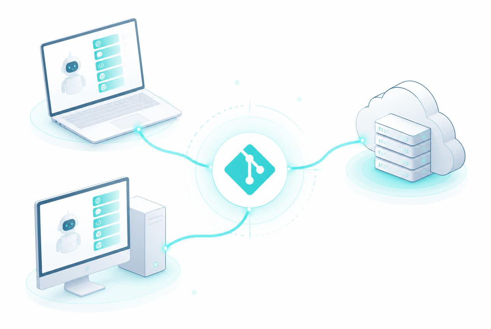
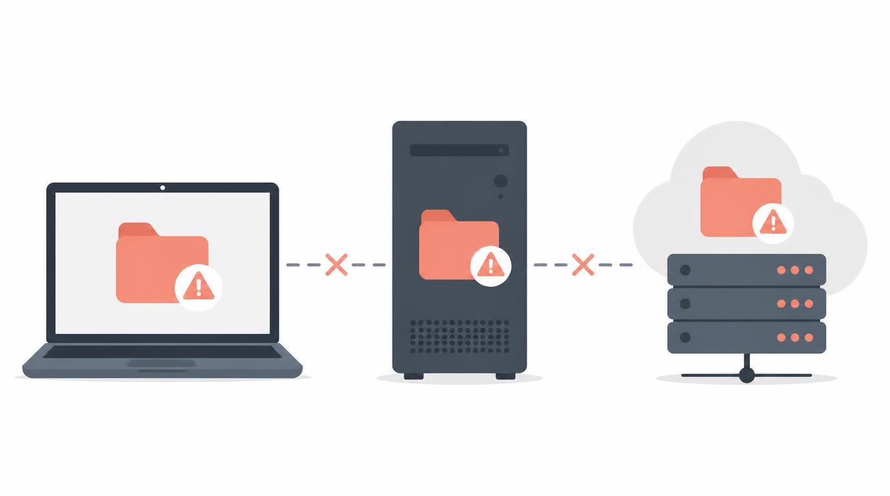
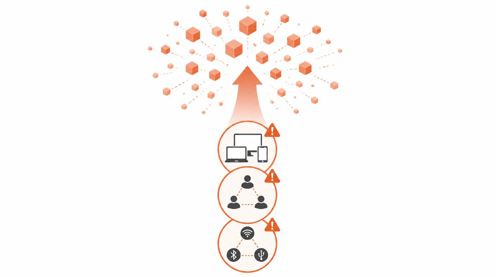
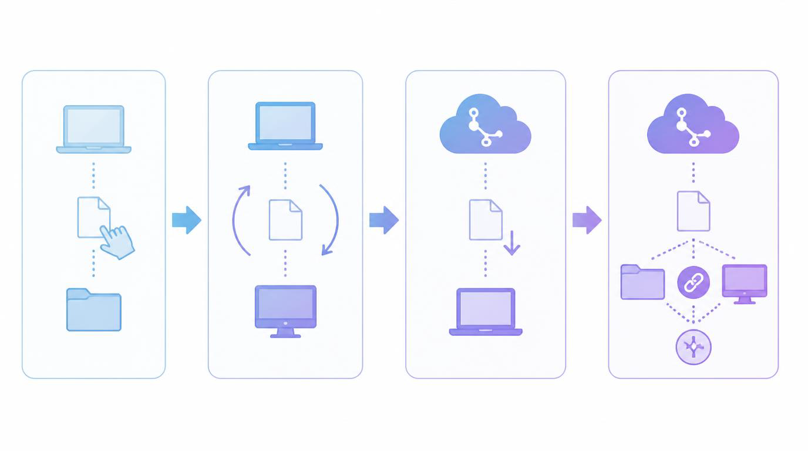
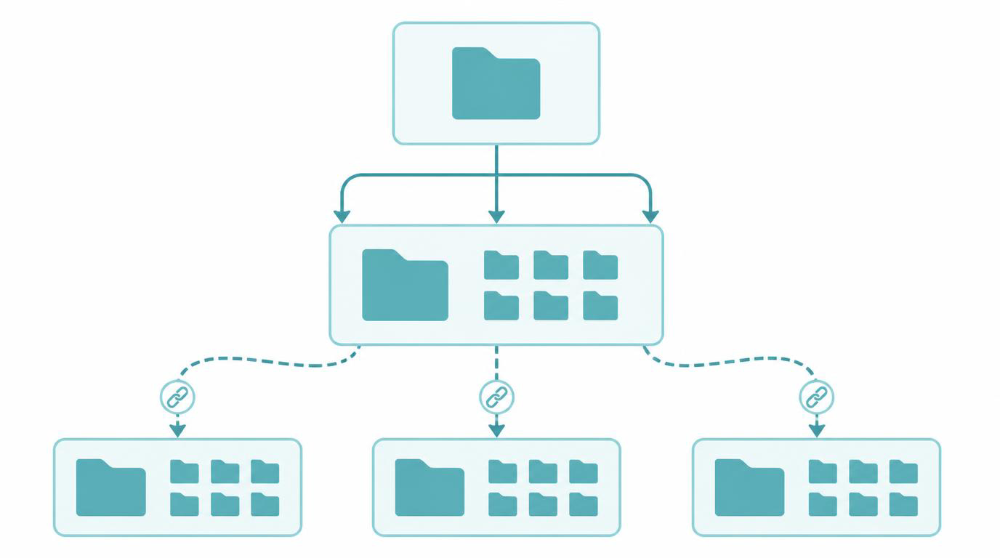
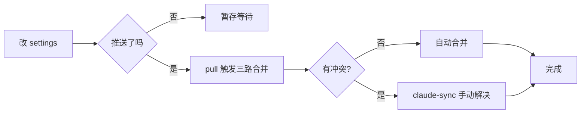
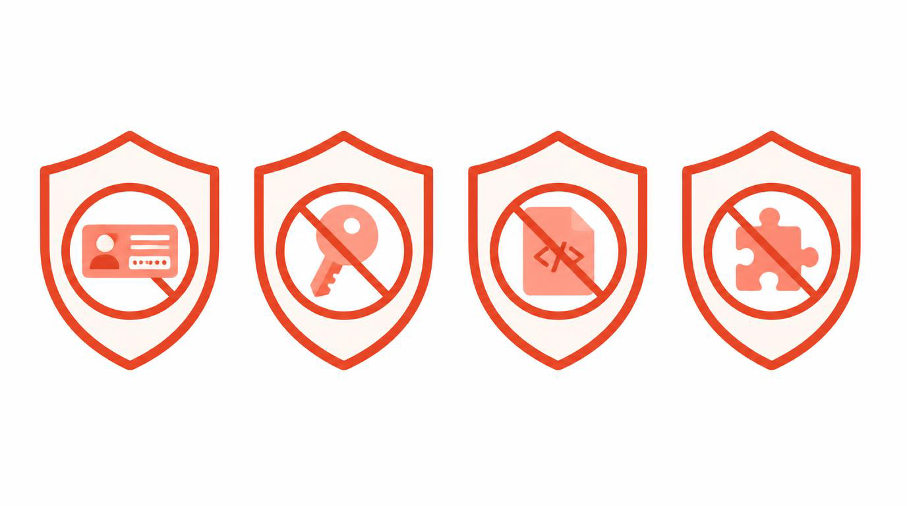

## 翻车现场

上周五晚上，我在家里的 PC 上调了一个 Skill，用来自动给 Markdown 文章补 frontmatter，写得挺顺手，就准备收工了。

第二天到公司，打开 MacBook 跑 Claude Code，发现那个 Skill 不见了。

我当时没在意，随手重写了一遍。第三天晚上回家，又没了。

这时我才反应过来：我的 Claude Code 是按机器独立配置的，**Skill、Plugin、settings 全都不通**。三台设备（家里 PC、公司 Mac、云上 VPS），相当于三个完全独立的 Agent 环境，每个都得手动维护一遍。

为了把这件破事一次性解决，我花了整个周末，把目前主流的几套同步方案都试了一遍。下面就是这次折腾的完整记录。

## Skill 到底是什么

在说同步之前，先讲清楚我们到底在同步什么。

Agent 的 Skill（技能），本质就是**一个文件夹**，里面包含一个 `SKILL.md`（YAML 头 + Markdown 描述），可以附带 `scripts/`、`references/`、`assets/` 几个子目录。Agent 加载 Skill 时，会读这个 `SKILL.md`，然后在合适的时候调用里面的脚本或资源。

这套格式是 Anthropic 在 2025 年 10 月开源的（[agentskills.io](https://agentskills.io/)），现在由社区共同维护，许可证 Apache-2.0。其他 Agent 厂商（Codex、Cursor、Gemini CLI 等）也在跟进，越来越多工具认这套规范。

（图片说明：上图展示同一个 Skill 在三台设备上分散存储、互不同步的现状。）

换句话说，**Skill 就是一个可复用的提示词包**。把它放到一个目录里，Agent 就能识别；放到不同设备上，Agent 也都能识别。理论上就是这么简单。

但现实没这么简单。

## 三个绕不开的同步问题

用 Agent 的人迟早撞上三件事：

**（1）多设备**。家里 PC、公司 Mac、临时租的云 VPS，每台都要跑 Claude Code。

**（2）多 Agent**。Claude Code、Codex、Cursor、Gemini CLI 各自有自己的 Skill 目录，同一个 Skill 要分别放一遍。

**（3）多协议**。除了 Skill，还有 Plugin、MCP 连接器、settings、CLAUDE.md 这堆配置，散落各处。

把这三件事的笛卡尔积乘一下，工作量会指数级增长。我一开始的应对方式，就是每台机器都手动维护一份。后果你也看到了——上周五那次"调好的 Skill 不见了"。

（图片说明：上图把多设备、多 Agent、多协议三个痛点叠加，形成"指数级工作量"的视觉冲击。）

## Plugin 比 Skill 多一层麻烦

Skill 相对好办，毕竟就是一个目录，复制粘贴就行。Plugin 更复杂。

Plugin 是 Skill + MCP 连接器 + 呈现资产的打包。Claude Code 装一个 Plugin，会涉及三个地方：

- `~/.claude/plugins/cache/` 是从 marketplace 下载下来的本地缓存；
- `~/.claude/plugins/` 里记录了启用了哪些 Plugin；
- `~/.claude/settings.json` 里有更细的启用开关。

这三处是分离的。第一处是从网络上能再生的数据，第二处和第三处才是真正的"配置意图"。

> 一个常见的错误，是把整个 `~/.claude/plugins/` 目录同步到 Git 仓库。结果每次拉代码，marketplace 缓存都会冲突，Pull 经常失败。

OpenAI 侧的情况类似，但更进一步：Codex 的官方文档明确说，本地写 Skill 目录就好，**要分发给别人用就打包成 Plugin**（ChatGPT 和 Codex 共享一个 universal plugin directory）。

到这里，我们其实已经触到了同步问题的本质：**同步的是意图，不是缓存**。

## 我试过的几种方案

下面是我这个周末试过的四种方案，从易到难。

**（1）手动同步**。每台机器手动复制 Skill 文件夹。最笨，但能跑。缺点是只要改了任何一处，三台机器就得手动同步一次。

**（2）rsync 双向同步**。用 `unison` 或 `lsyncd` 在两台机器之间双向同步。我试了一次，立刻翻车：家里 PC 改了，公司 Mac 还没来得及拉，结果公司 Mac 上覆盖了家里 PC 的版本。双向同步在多设备场景下非常危险。

**（3）Git 仓库做真源**。建一个私有 Git 仓库，把 Skill 全部放进去，每台设备 `git pull`。这是社区里最常见的方案。问题在于怎么处理配置文件——`~/.claude/settings.json`、`~/.claude/CLAUDE.md` 这些路径都不在仓库里，git pull 之后还要手动复制或软链。

**（4）Git + 软链 + 合并工具**。Git 仓库管所有 Skill 和配置，每台设备软链到对应的目录。如果两台机器同时改了配置，用 [claude-sync](https://github.com/baptisterajaut/claude-sync) 这类三路合并工具显式解决冲突，而不是静默覆盖。

我最终选的是第 4 种。

（图片说明：上图把四种同步方案从手动 → rsync → Git → Git+软链 的演进关系画出来，标注各自的痛点。）

## 我现在的架构

下面是经过一个周末的折腾之后，我最终采用的架构。

（图片说明：上图把单一 Git 仓库作为真源、其他 Agent 目录通过软链指向 Claude Code 实体目录的关系画清楚。）

关键的设计有三条：

**（1）Git 仓库是唯一的真源**。所有 Skill、settings、CLAUDE.md 都进仓库，不在设备本地手维护。多设备之间用 `git pull` 同步，不做双向 rsync。

**（2）`~/.claude/skills/` 是 Skill 文件的实体所在**。其他 Agent 的 Skill 目录（`~/.codex/skills/`、`~/.cursor/skills/` 等）一律放**指向 `~/.claude/skills/` 的软链**，方向绝不能反。

为什么方向这么重要？我第一版反过来设计过，让 `~/.claude/skills/` 指向一个共享目录。结果出过一个诡异的 bug：在 Codex 里改了 Skill，回到 Claude Code 看不到；最后排查半小时，才发现软链方向反了，导致 Codex 写到的是临时副本。

**（3）冲突显式解决，不静默覆盖**。如果两台设备都改了 settings，用 `claude-sync` 这类三路合并工具，让冲突暴露出来手工选择。静默覆盖才是数据丢失的最大来源。

（Mermaid 流程说明：上图展示改完 settings 后，三路合并工具如何显式处理冲突，避免静默覆盖。）

## 多 Agent 的兼容问题

上面的架构把 Claude Code 当成了"标准实现"，其他 Agent 通过软链来复用。这在大部分情况下能跑，因为 Skill 的格式已经是开放规范。

但有三种情况要单独处理：

**（1）Plugin 不通用**。Claude Code 的 Plugin 格式跟 Codex、Cursor 都不一样。要么装三套，要么只在一台 Agent 上用 Plugin。

**（2）MCP 连接器凭证每台设备各自授权**。MCP/连接器的 OAuth token 属于设备私有，新机器 bootstrap 后要逐个 re-auth——这是安全特性，不是缺陷，别试图把 token 也同步了。

**（3）分发给别人用，走 universal plugin directory**。如果你的 Skill 是给别人用的，打包成 Plugin 发布到 [Vercel Skills](https://github.com/vercel-labs/skills) 或 OpenAI 的 plugin directory，让 Vercel 安装器处理各家 Agent 的兼容。

## 安全红线

最后讲几条安全红线，**违反任何一条都等于把账号送人**。

（图片说明：上图用警示色块把四条安全红线视觉化。）

**（1）`.credentials.json`、OAuth token、API key 永远不要进 Git 仓库**。哪怕是私有仓库，也别这么做——一旦仓库被错误地推到了公开平台，所有 token 都泄露。

**（2）提交前跑敏感文件扫描**。我给自己定了一个肌肉记忆：`git add .` 之前一定先 `git ls-files | grep -iE 'credentials|\.env|token|oauth'`，扫到任何一条都立刻删掉。

**（3）`settings.local.json`、`projects/`、`sessions/`、`todos/` 这些是设备私有状态**，不同步。它们是运行时的临时数据，每台机器各跑各的。

**（4）Plugin 的 marketplace 缓存不同步**。`~/.claude/plugins/cache/` 是从网络上能再生的数据，把它同步进 Git 仓库会制造冲突。同步"启用清单"就够了。

## 最后

这件事看上去不起眼，但每个用 Agent 的人都会撞上。我的建议是，**不要拖到最后一天再处理**——等你在公司 Mac 上调试完发现家里 PC 上没有，时间成本已经很高了。

最好的时机，是当你第一次在两台设备上同时用 Agent 的时候，就把这套同步架构搭起来。哪怕只有两个 Skill、两个 Agent，也值得花半小时建一个私有仓库 + 软链。

我目前这套架构已经稳定跑了两个月，三台设备之间再没有出现过"调好的 Skill 不见了"的事情。

（完）

## 参考

- [Syncing Claude Code settings between computers — Brian Lovin](https://brianlovin.com/writing/syncing-claude-code-settings-between-computers-am7lNQ8) · 范式参考
- [baptisterajaut/claude-sync](https://github.com/baptisterajaut/claude-sync) · 三路合并同步工具
- [Fluory/claude-sync-kit](https://github.com/Fluory/claude-sync-kit) · 向导式插件
- [ChenChiWang/claude-code-chezmoi-sync](https://github.com/ChenChiWang/claude-code-chezmoi-sync) · chezmoi 方案
- [Agent Skills 开放规范](https://agentskills.io/) · [agentskills/agentskills](https://github.com/agentskills/agentskills)
- [Cross-Agent Skills: Portability in 2026 — MCP.Directory](https://mcp.directory/blog/cross-agent-skills-cursor-codex-cline-antigravity-gemini-mastra-portability)
- [OpenAI Codex: Build skills](https://developers.openai.com/codex/skills) · 官方文档
- [vercel-labs/skills](https://github.com/vercel-labs/skills) · 跨 Agent 安装器
