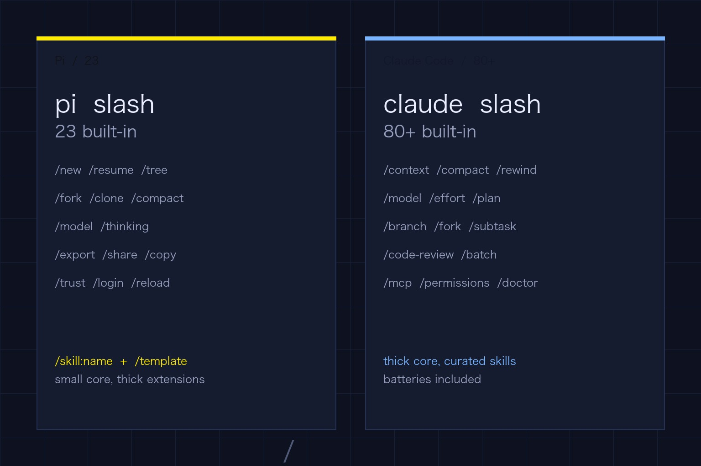
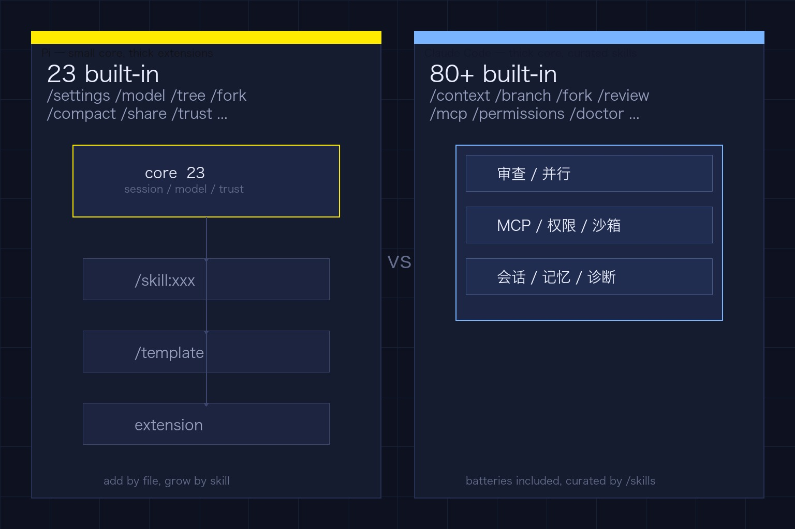
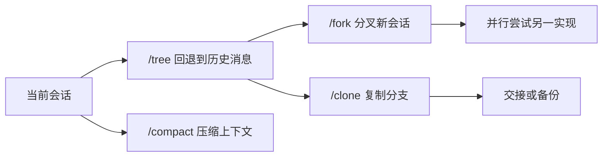
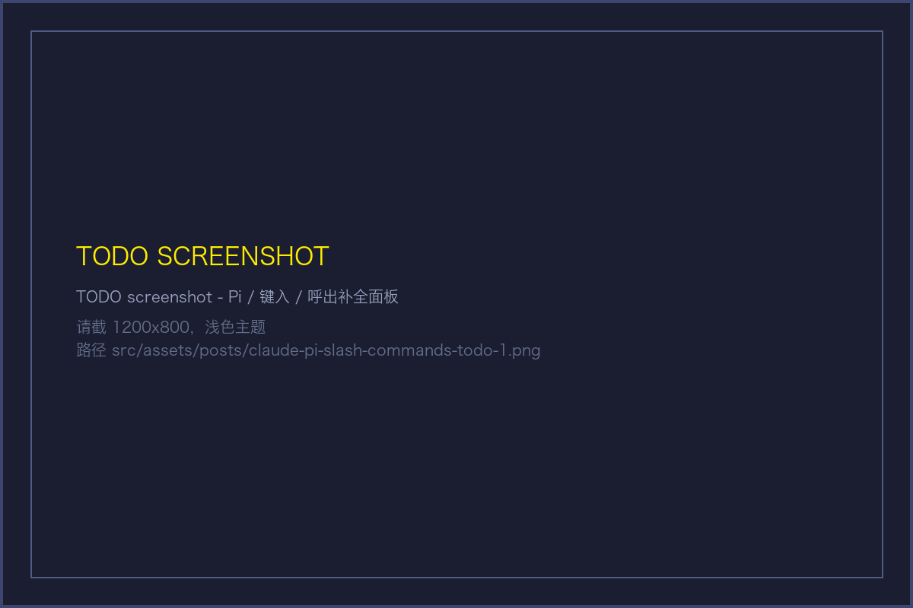
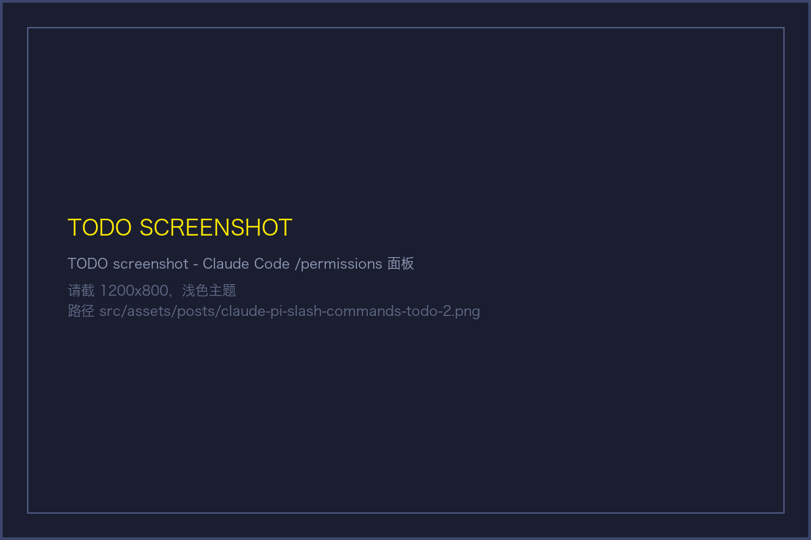

敲下 /，两边都弹出命令面板，规模却差得很远。Pi 那边 23 个内置命令，只管会话和模型，工作流交给扩展和技能。Claude Code 这边 80 多个，会话、并行、审查、集成、诊断全在面板里，装好就是一个准 IDE。这篇文章按功能拆两张命令表，顺带讲清两边为什么这样选。



## Pi 的最小命令集

Pi 的内置斜杠定义在 `packages/coding-agent/src/core/slash-commands.ts` 的 `BUILTIN_SLASH_COMMANDS`，以源码为准。当前版本 0.84.3，导出 23 个。其余命令通过两种扩展机制加入，一是 Prompt Template 展开为 `/名字`，二是 Skill 注册为 `/skill:名字`。扩展本身也能注册斜杠，通过 `prompt` 透出。

内置命令按日常使用频率分成四组。

### 会话与导航

| 命令 | 作用 | 什么时候敲 |
| --- | --- | --- |
| /new | 新开一个会话，当前会话自动存档 | 想另起一件事，不想污染当前上下文 |
| /resume | 从历史会话里挑选并恢复 | 跨天续做或切分支前找回现场 |
| /name | 给当前会话命名 | 在 `/resume` 列表里快速识别 |
| /session | 展示会话文件路径、ID、消息数、token 和费用 | 排查费用或确认存盘位置 |
| /tree | 打开会话树，在任意历史消息处继续 | 走错分支要回退，或想对比两条路径 |
| /fork | 从某条历史用户消息分叉出新会话 | 保留主线，同时试另一条实现 |
| /clone | 复制当前分支到全新会话文件 | 把干净的分支交给同事或另起并行 |
| /compact | 手动压缩上下文，可带自定义指令 | 上下文快满时，用自己的总结偏好释放空间 |

Pi 的会话落在 `~/.pi/agent/sessions/`，以工作目录组织。`/tree` `/fork` `/clone` 配合 `pi --continue` `pi --resume` `pi --fork` 等 CLI 参数，构成了完整的会话工作流。`usage.md` 把这套流程和消息队列放在同一份文档里，`/compact` 也在其中。



### 上下文与显示

| 命令 | 作用 |
| --- | --- |
| /settings | 打开设置面板，调思维等级、主题、消息投递和传输 |
| /thinking | 直接设置思维等级，支持 off minimal low medium high xhigh max |
| /export | 导出会话，默认 HTML，指定 .html 或 .jsonl 可控格式 |
| /import | 从 JSONL 导入并恢复会话 |
| /share | 上传为私有 GitHub Gist，生成可分享的 HTML 链接 |
| /copy | 复制上一条助手消息到剪贴板 |
| /reload | 重载快捷键、扩展、技能、模板、主题和上下文文件 |
| /hotkeys | 展示全部快捷键 |
| /changelog | 展示版本历史 |

`/settings` 是总开关。思维等级、主题、tui 模式都在这里切换，改动即时生效。`/reload` 在修改 `keybindings.json` 或新增扩展后最常用，无需重启即可生效。`/export` 和 `/share` 解决复盘和对外分享，前者在本地落文件，后者走 Gist 私有链接。

### 模型与工作区信任

| 命令 | 作用 |
| --- | --- |
| /model | 打开模型选择器，支持 provider/model 写法 |
| /scoped-models | 勾选哪些模型参与 Ctrl+P 循环 |
| /trust | 把当前项目的信任决策写入 trust.json |
| /login | 配置提供商鉴权，可带 provider 参数 |
| /logout | 移除提供商鉴权 |

Pi 强调项目信任。首次在新目录启动，Pi 先询问是否信任，信任后才加载 `.pi/settings.json` 和项目扩展。`/trust` 把决策落盘，方便下一次免询问。`/model` 和 `/scoped-models` 配合 `pi --models` 启动参数，能把模型循环收敛到你常用的两三个。

### 退出与补充

| 命令 | 作用 |
| --- | --- |
| /quit | 退出 Pi |
| /llama | 文档中列出的 llama.cpp 路由模型管理，仅在 `usage.md` 表格出现，源码 `BUILTIN_SLASH_COMMANDS` 未包含，需通过对应扩展或版本提供 |

内置表与文档表格存在一处差异。源码以 `slash-commands.ts` 为准，未包含 `/llama`。`usage.md` 的斜杠表把 `/llama` 列为 Download、load 和 unload llama.cpp router models 的入口。遇到找不到的命令，先确认是否需要安装对应扩展或升级版本。



## Pi 的扩展机制

内置之外，Pi 还有两类动态斜杠，它们数量不固定，随你安装的内容而增长。

### 1. Prompt Template 展开为 /名字

把 Markdown 放进 `~/.pi/agent/prompts/` 或项目 `.pi/prompts/`，文件名即命令名。`review.md` 就变成 `/review`。frontmatter 的 `description` 决定补全提示，`argument-hint` 决定参数占位。模板内部支持 `$1` `$2` `$@` `$ARGUMENTS` `${1:-默认值}` `${@:N:L}` 等写法，调用时直接传参。

```md
---
description: 评审已暂存的改动
argument-hint: "[提交信息]"
---
评审 `git diff --cached` 的结果，关注错误处理和安全边界。额外要求 $1
```

适合把重复的审查、总结、发版检查写成模板，比每次手动输入更可靠。

### 2. Skill 注册为 /skill:名字

Skill 目录里必须有 `SKILL.md`，它注册为 `/skill:名字`。例如安装 `blog` 技能后，`/skill:blog` 就会出现在补全里，参数直接跟在后面。

```bash
/skill:blog 写一篇关于 Astro 6 的笔记
/skill:research 调研某个技术方案
```

Skill 的发现路径包括全局 `~/.pi/agent/skills/` `~/.agents/skills/`、项目 `.pi/skills/` `.agents/skills/`，以及通过 `pi install` 安装的包。`--skill` 和 `--prompt-template` 也能在启动时显式挂载。禁用发现时可用 `--no-skills` `--no-prompt-templates`，再用显式路径精准加载。

扩展还能通过 `prompt` 注册完全自定义的斜杠。Pi 在设计上故意不内置子代理、计划模式或权限弹窗，这些都交给扩展去实现。内置保持最小，其余交给扩展，这是 Pi 的取舍。

## Claude Code 的内置命令

Claude Code 的策略相反。斜杠直接覆盖开发全流程，官方在 `code.claude.com/docs/en/commands` 维护完整清单，按字母顺序列出。数量在 80 以上，且持续增加，按功能拆成几组后更容易检索。

### 上下文和记忆

这组命令决定 Claude 能看到什么以及看到多少。

| 命令 | 作用 |
| --- | --- |
| /add-dir | 为当前会话追加可访问目录 |
| /cd | 把会话迁移到新工作目录，保留对话 |
| /memory | 编辑 CLAUDE.md，开关自动记忆 |
| /context | 用栅格可视化当前上下文占用，可加 all 展开细节 |
| /clear | 清空上下文开启新对话，alias /reset /new |
| /compact | 按指令总结并释放上下文 |
| /autocompact | 设置自动压缩阈值，例如 500k 或 auto |
| /rewind | 回退对话或代码到之前某个点，alias /checkpoint /undo |

`/context` 和 `/compact` 经常一起用。先用 `/context` 看是哪类工具或记忆把窗口撑满，再用 `/compact` 定向压缩。

### 模型与执行节奏

| 命令 | 作用 |
| --- | --- |
| /model | 切换模型，支持左右键调 effort，s 键仅对当前会话生效 |
| /effort | 设置 effort 等级 low medium high xhigh max ultracode auto 或 status |
| /advisor | 开关顾问模型，可选 fable opus sonnet |
| /fast | 开关 fast 模式 |
| /plan | 直接进入计划模式，可带任务描述 |
| /tui | 切换渲染器 default 或 fullscreen |
| /tasks | 查看当前会话的后台任务，alias /bashes |
| /loop | 定时重复执行某个提示，alias /proactive |

`/effort` 和 `/fast` 在模型响应期间也能切换，换挡后下一个请求即生效。`/loop` 适合轮询类任务，例如每 5 分钟检查部署是否完成。

### 会话与并行

| 命令 | 作用 |
| --- | --- |
| /resume | 恢复会话或打开会话选择器，alias /continue |
| /branch | 在当前点创建对话分支并切入 |
| /fork | 复制对话到新的后台会话，可带初始提示 |
| /subtask | 派生一个继承全量对话的子代理 |
| /background | 把当前会话放到后台，alias /bg |
| /teleport | 把远端网页会话拉到本地终端，alias /tp |
| /rename | 重命名当前会话 |
| /export | 导出对话为文本 |

`/branch` `/fork` `/subtask` 是三条不同的并行语义。`/branch` 留在当前终端试另一条思路，`/fork` 另起后台会话，`/subtask` 让子代理在当前会话内把结果带回来。需要多开终端并行时，配合 git worktree 最干净。

### 审查与协作

| 命令 | 作用 |
| --- | --- |
| /diff | 打开交互式 diff 浏览器，按轮次浏览改动 |
| /code-review | 审查当前 diff 或指定 PR 分支路径，alias /review，可加 --fix --comment effort 等级 |
| /simplify | 只做清理类审查，查复用、抽象层级和简化机会 |
| /security-review | 按分支与远端默认分支的 diff 做安全扫描 |
| /batch | 把大规模改动拆成 5 到 30 个独立单元，并行在 worktree 中执行并提 PR |
| /autofix-pr | 在云端盯住当前分支的 PR，CI 失败或有人评论就自动修 |

Claude Code 把审查做成一等公民。`/code-review` 默认本地多代理审查，`ultra` 走云端深度审查并可回帖。`/batch` 适合跨文件迁移类任务，研究、拆解、执行和提 PR 一条链路走完。

### 工具与集成

| 命令 | 作用 |
| --- | --- |
| /mcp | 管理 MCP 服务连接和鉴权，支持 reconnect enable disable |
| /hooks | 查看工具事件钩子配置 |
| /permissions | 管理工具权限的 allow ask deny 规则 |
| /sandbox | 开关沙箱，仅部分平台可用 |
| /ide | 管理 IDE 集成并显示状态 |
| /chrome | 配置 Chrome 集成 |
| /install-github-app | 为仓库安装 GitHub App，可同时配置 Actions |
| /install-slack-app | 安装 Slack App 并走 OAuth |
| /web-setup | 用本地 gh 凭证连接网页版 |

权限相关最常用的是 `/permissions`。它提供交互面板查看规则、增删规则和查看 auto mode 的拒绝记录。MCP 相关走 `/mcp`，无参数打开面板，`reconnect` 定向重连。



### 系统与可观测

| 命令 | 作用 |
| --- | --- |
| /doctor | 全面体检，查安装、PATH、未用技能和慢钩子，alias /checkup |
| /bug | 上报问题并选择附带多少历史，alias /share |
| /feedback | 发送产品反馈，带草稿队列 |
| /heapdump | 导出堆快照和内存分析到桌面 |
| /status | 打开设置的状态页，显示版本、模型、账号和连通性 |
| /usage | 显示会话费用和计划用量，alias /cost /stats |
| /help | 显示帮助和可用命令 |
| /config | 打开设置，可直接用 key=value 修改，alias /settings |
| /theme | 切换颜色主题，含 auto 和无障碍主题 |
| /keybindings | 打开快捷键配置 |
| /release-notes | 按版本查看更新日志 |

`/doctor` 的输出值得定期看一遍。它会提示重复安装、配置解析失败、技能列表超预算等问题，并给出是否自动修复的确认。

### 内容与生态

| 命令 | 作用 |
| --- | --- |
| /skills | 列出可用技能，支持搜索、按 token 排序和 Space 切换可见性 |
| /plugin | 管理插件，无参数打开菜单，支持 list install enable disable |
| /reload-skills | 重新扫描技能和命令目录 |
| /reload-plugins | 重载已激活插件 |
| /agents | 提示通过对话创建子代理，旧版本为交互式管理 |
| /list-agents | 列出可通信的子代理和队友，alias /peers |
| /init | 初始化项目的 CLAUDE.md 引导 |
| /import | 从 Codex 或 Gemini 导入配置，可加 --dry-run --yes |
| /workflow-authoring | 加载动态工作流脚本的编写参考 |
| /workflows | 查看工作流进度并暂停或恢复 |
| /schedule | 创建或管理云端例程，alias /routines |
| /deep-research | 扇出网页搜索并交叉验证后生成引用报告 |

Claude Code 的技能同样通过斜杠触发，但命名规则与 Pi 不同。项目技能目录名即命令名，插件技能带命名空间前缀，例如 `/my-plugin:review`。frontmatter 的 `disable-model-invocation` 和 `user-invocable` 控制谁能触发，`allowed-tools` 能在调用当轮预授权工具。

### 其它入口

| 命令 | 作用 |
| --- | --- |
| /radio | 打开 lo-fi 电台 |
| /stickers | 订购贴纸 |
| /color | 设置当前会话的提示条颜色 |
| /btw | 提一个不计入对话的旁路问题 |

这几条不影响主流程，但在演示和日常使用里会碰到。

## 两者的核心分歧

### 1. Pi 把工作流交给扩展

内置只保留会话、模型和信任这些必须跨项目一致的能力。工作流尽量写成可复用的 Skill 或 Template，需要时用 `/skill:xxx` 显式调起，少让模型自行决定何时介入。好处是命令面板干净，团队可以把规范沉淀为技能，升级和回滚都围绕文件系统完成。代价是初装时需要自己挑扩展，命令名取决于你装了什么。

### 2. Claude Code 把功能全部内置

审查、并行、沙箱、MCP、计划任务和可观测都内置，命令即功能。好处是开箱可用，`/doctor` `/permissions` `/context` 等诊断链路完整。代价是面板较长，需要用 `/skills` 的 Space 切换或 `skillOverrides` 控制可见性，靠 `disable-model-invocation` 抑制模型过度触发。

从斜杠的形态也能看出差异。Pi 的动态斜杠是开放的，`prompts/` 文件名和 `skills/` 目录名都能生成新命令。Claude Code 的动态斜杠受命名空间约束，插件技能必须带前缀，个人技能以目录名为准，frontmatter 的 `name` 只改展示名。两者都支持参数，Pi 强调 `$1` `$@` 等位置参数展开，Claude Code 在技能里支持 `$ARGUMENTS` `$0` `$name` 以及 `${CLAUDE_SKILL_DIR}` 等路径变量。

## 速查与实操

### 1. 三条核心规则

1. 斜杠命令在交互界面触发，命令面板按 `/` 呼出，自动补全同时覆盖斜杠和路径
2. 技能需要先可被发现再可被调用，改过目录后在 Pi 敲 `/reload`，在 Claude Code 敲 `/reload-skills`
3. 权限和上下文是高频开关，Pi 看 `/settings` 和 `/trust`，Claude Code 看 `/permissions` `/context` `/doctor`

### 2. 给 Pi 用户的起点

常用组合是 `/model` 切模型，`/tree` `/fork` 管理并行思路，`/compact` 控上下文，`/export` 或 `/share` 留档。把重复流程写成模板或技能，例如把评审沉淀为 `/review` 模板，把调研沉淀为 `/skill:research`，比每次手动输入更可靠。

### 3. 给 Claude Code 用户的起点

先跑 `/doctor` 做一次体检，再用 `/permissions` 收敛工具权限。并行前分清 `/branch` `/fork` `/subtask` 的隔离级别，审查前分清 `/code-review` `/simplify` `/security-review` 的关注点。技能太多导致提示过长时，去 `/skills` 把低频技能切到 name-only 或 user-only。

两者可以并用。很多团队同时保留 Pi 和 Claude Code，Pi 负责把团队规范做成技能，Claude Code 负责把重型审查和并行编排跑起来。斜杠只是入口，入口背后是对工作流的拆分方式。拆分清楚了，命令自然就记住了。

## 待补图清单

- `claude-pi-slash-commands-todo-1.png` - Pi 斜杠补全面板，浅色主题 1200x800，需包含 `/` 触发后的命令列表
- `claude-pi-slash-commands-todo-2.png` - Claude Code 权限面板，浅色主题 1200x800，需包含 allow/ask/deny 规则

以上两张为实拍占位，已生成临时占位图保证构建通过，请按描述替换为真实截图。

## 参考

- Pi 使用文档与斜杠表 https://github.com/earendil-works/pi/blob/main/packages/coding-agent/docs/usage.md
- Pi 内置斜杠源码 BUILTIN_SLASH_COMMANDS https://github.com/earendil-works/pi/blob/main/packages/coding-agent/src/core/slash-commands.ts
- Claude Code 斜杠命令总表 https://code.claude.com/docs/en/commands
- Claude Code 技能与斜杠机制 https://code.claude.com/docs/en/slash-commands
- Pi Prompt Templates 文档 https://github.com/earendil-works/pi/blob/main/packages/coding-agent/docs/prompt-templates.md
- Pi Skills 文档 https://github.com/earendil-works/pi/blob/main/packages/coding-agent/docs/skills.md
