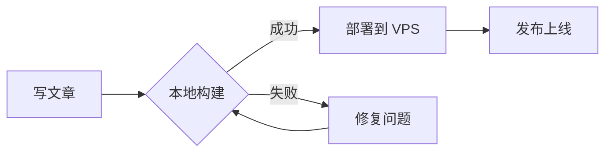
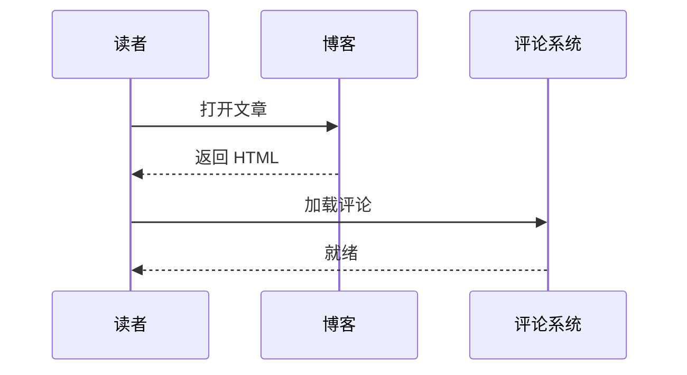
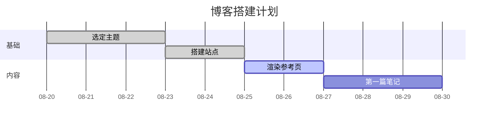

## 你好，世界 🎉

这是使用 [Retypeset](https://github.com/radishzzz/astro-theme-retypeset) 主题搭建的第一篇文章，同时兼作本站的「渲染参考页」——几乎所有 Markdown 语法都收在这一页里，升级主题、调整样式后拿来回归一遍即可。

> 记录学习，分享所得。

中文排版是这套主题的重点：中西文之间自动加空格，标点悬挂与挤压由排版引擎（heti）处理。下面这段长文用来观察段落的真实观感——行高、字距，以及混排时的细节。2024 年 8 月，Astro 5 发布时把 Content Layer 定为默认；到了 Astro 6，构建速度又快了约 30%，1.2345 这样的长数字、100%（百分号）、3:4 的比例、「直角引号」与 "弯引号"、省略号……以及破折号——都会在这一段里出现，看看它们挤在一起是否依然舒服。The quick brown fox jumps over the lazy dog, and 中英混排 continues without a hitch.

把学到的知识、踩过的坑记录下来，既是总结，也是分享。

---

## 标准语法

### 行内元素

**粗体**、*斜体*、***粗斜体***、~~删除线~~、~~**粗体删除**~~、`行内代码`，以及它们的随意组合 **粗体内 *斜体* 和 `代码`**。

三种链接：[行内链接](https://xmon.me)、[带标题的参考链接][ref]、以及自动链接 <https://docs.astro.build>；裸链接也能识别：https://github.com/radishzzz/astro-theme-retypeset。

上下标用内嵌 HTML：H<sub>2</sub>O、2<sup>10</sup> = 1024；按键 <kbd>Ctrl</kbd> + <kbd>Alt</kbd> + <kbd>Del</kbd>；高亮 <mark>被标记的文字</mark>。

硬换行（行尾两个空格）：  
这是紧跟着的下一行，两行之间没有空行却各自成行。

### 列表

无序列表，可嵌套：

- 第一层
  - 第二层
    - 第三层（缩进够深才会进入层级）
- 回到第一层
- 列表项里可以有 **加粗**、`代码` 和 [链接](https://xmon.me)

有序列表：

1. 第一步：安装依赖
2. 第二步：启动开发服务器
   1. 嵌套的有序项
   2. 另一个嵌套项
3. 第三步：构建发布

任务列表：

- [x] 支持 Markdown 全部语法
- [x] 支持代码高亮
- [ ] 支持数学公式（见下文，其实已支持）
- [ ] 待办事项示例

松散列表（项之间有空行，段距更大）：

- 第一项

- 第二项，包含一个段落：

  缩进的从属段落，属于本列表项。

- 第三项

### 引用

> 单层引用：把学到的知识记录下来。

> 多层嵌套：
>
> > 第二层引用。
> >
> > > 第三层引用，看看边距如何叠加。

> 引用里也能放代码：
>
> ```js
> console.log('quote 里的代码块')
> ```

GitHub 风格告警（`> [!TYPE]` 写法，与下文 `:::type` 容器等效）：

> [!TIP]
> 这是 `> [!TIP]` 写法的提示块。

### 代码块（Shiki 双主题）

TypeScript：

```ts
// TypeScript：类型与接口
interface Post {
  title: string
  published: Date
  tags?: string[]
}

export function formatPost(post: Post): string {
  const year = post.published.getFullYear()
  return `[${year}] ${post.title} (${post.tags?.join(', ') ?? '无标签'})` // 尾随注释
}
```

JavaScript 与 Python：

```js
// JavaScript：一行很长的代码用来测试横向滚动区域是否正常工作，这一行刻意写得很长很长很长
const fibonacci = n => (n < 2 ? n : fibonacci(n - 1) + fibonacci(n - 2))
```

```python
# Python：类型注解与 f-string
def greet(name: str) -> str:
    """向访客问好"""
    return f"你好，{name}！欢迎常来看看。"

print(greet("世界"))
```

Rust 与 Bash：

```rust
// Rust：模式匹配
fn main() {
    let lang = "Astro";
    match lang {
        "Astro" => println!("内容驱动网站"),
        _ => println!("其他"),
    }
}
```

```bash
# Bash：常用命令
pnpm install && pnpm dev
pnpm build && pnpm deploy:vps
```

JSON、CSS、HTML：

```json
{
  "name": "blog",
  "type": "module",
  "dependencies": {
    "astro": "^6.0.0",
    "sharp": "^0.34.0"
  }
}
```

```css
/* CSS：变量与暗色适配 */
:root {
  --text-primary: #1f2328;
}
.dark {
  --text-primary: #e6edf3;
}
```

```html
<!-- HTML：结构高亮 -->
<article class="post">
  <h2>标题</h2>
  <p>段落 <a href="/posts/">链接</a></p>
</article>
```

Diff 与无语言块：

```diff
+ 新增的一行
- 删除的一行
  保持不变的一行
```

```
没有声明语言的代码块，仅以等宽字体呈现。
```

### 表格

三种对齐方式的表格：

| 左对齐 | 居中对齐 | 右对齐 |
| :----- | :------: | -----: |
| 单元格 | 单元格 | 1.00 |
| 中文 | English | -3.14 |
| `代码` | **加粗** | ~~删除~~ |
| [链接](https://xmon.me) | $E = mc^2$ | 100% |

稍长的表格（含 CJK 与空单元格）：

| 语法 | 示例 | 备注 |
| :--- | :--- | :--- |
| 粗体 | **text** | 两个星号 |
| 斜体 | *text* | 一个星号 |
| 代码 | `code` | 反引号 |
| 删除线 | ~~text~~ | 双波浪线 |
| 脚注 | 见下文[^1] | |
| 数学 | $a^2 + b^2 = c^2$ | KaTeX |

### 分隔线

---

### 脚注与转义

正文里的脚注引用[^1]，还有一个带名字的脚注[^长注]。

[^1]: 这是第一个脚注，脚注内容支持 **Markdown**。
[^长注]: 带名字的脚注，指向更稳定。

转义字符演示：\*不是斜体\*、\_不是强调\_、\`不是代码\`、\|不是表格\|、\\反斜杠本身\\。

### 内嵌 HTML

<details>
<summary>点击展开：原生 details 折叠块</summary>

折叠块内部同样渲染 **Markdown**（前提是与标签之间留出空行）。

</details>

---

## 主题增强

### 数学公式（KaTeX）

行内公式：质能方程 $E = mc^2$，欧拉恒等式 $e^{i\pi} + 1 = 0$，勾股定理 $a^2 + b^2 = c^2$。

块级公式——高斯积分：

$$
\int_{-\infty}^{\infty} e^{-x^2} \, dx = \sqrt{\pi}
$$

多行对齐（麦克斯韦方程组两例）：

$$
\begin{aligned}
\nabla \cdot \mathbf{E} &= \frac{\rho}{\varepsilon_0} \\
\nabla \cdot \mathbf{B} &= 0
\end{aligned}
$$

矩阵与分段函数：

$$
A = \begin{pmatrix} 1 & 2 \\ 3 & 4 \end{pmatrix},
\qquad
A^{-1} = \frac{1}{\det A} \begin{pmatrix} 4 & -2 \\ -3 & 1 \end{pmatrix}
$$

$$
f(x) =
\begin{cases}
x^2, & x \geq 0 \\
-x, & x < 0
\end{cases}
$$

### Mermaid 图

流程图：



时序图：



甘特图：



### 提示容器

五种告警容器，支持 `[自定义标题]`：

:::note
NOTE：普通说明，用于补充背景信息。
:::

:::tip[自定义标题的 TIP]
TIP：小技巧——提示容器可以带自定义标题。
:::

:::important
IMPORTANT：重要信息，不建议忽略。
:::

:::warning
WARNING：警告，操作可能产生意外后果。
:::

:::caution
CAUTION：危险操作，请务必确认。
:::

折叠容器（`:::fold[标题]`）：

:::fold[点我展开：折叠容器]
折叠容器内部可以放任何 Markdown 内容——段落、列表、代码块都可以。

```js
console.log('折叠容器里的代码块')
```

:::

### 图片

单图带题注（alt 文本即 figcaption）：


alt 以下划线开头则不显示题注：


相册容器（`:::gallery` 包裹多图）：

:::gallery


:::

极限宽高比（2048 × 688，约 3 : 1）：


---

## 嵌入卡片（需外网环境加载）

以下六种卡片依赖第三方接口或 iframe：GitHub 卡与 B 站卡片直连可加载；YouTube、Tweet、CodePen、Spotify 需要访客具备外网环境，加载失败属正常现象。

**GitHub 仓库卡片**：

::github{repo="radishzzz/astro-theme-retypeset"}

**Bilibili 视频**：

::bilibili{id="BV1GJ411x7h7"}

**YouTube 视频**：

::youtube{id="dQw4w9WgXcQ"}

**Tweet**：

::tweet{url="https://x.com/jack/status/20"}

**CodePen**：

::codepen{url="https://codepen.io/chriscoyier/pen/gfdDu"}

**Spotify**：

::spotify{url="https://open.spotify.com/track/4cOdK2wGLETKBW3PvgPWqT"}

---

以上即本站 Markdown 渲染能力的全部演示。欢迎常来看看！

[ref]: https://github.com/radishzzz/astro-theme-retypeset "Retypeset 主题仓库"
