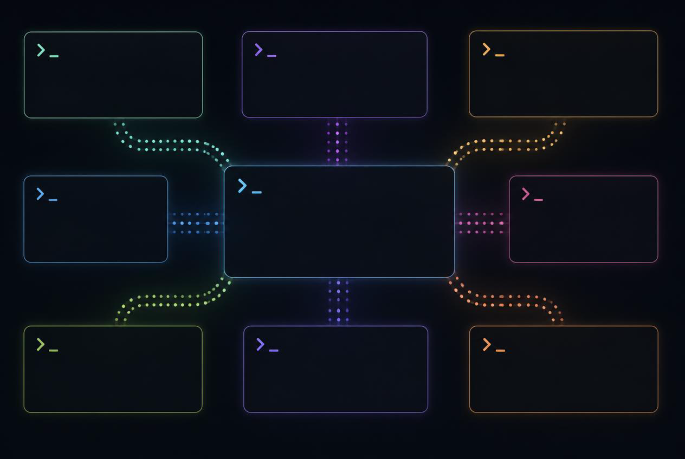

凌晨两点，四个智能体在不同项目里同时跑着。一个在重构数据管道，一个在修单测，一个卡在权限确认等你点击允许。笔记本合上，网络断开，第二天早上回来，所有进程还在原地，侧边栏直接告诉你谁在工作、谁被卡住了。这就是 Herdr 想解决的日常。

它不是又一个终端分屏工具。它是给编程智能体准备的运行时。

## Herdr 简介

一句话概括，Herdr 是单文件 Rust 二进制的终端复用器，专门为同时跑多个 AI 编程智能体设计。作者是 Ogulcan Celik，项目在 GitHub 上叫 `herdrdev/herdr`，今年 3 月创建，Apache 2.0 协议，8 月底已经超过 3.3 万 star。

和 tmux、zellij 最本质的区别在于感知能力。Herdr 会读每个窗格的实时画面，判断里面跑的是不是智能体，以及这个智能体现在是 working、blocked、idle 还是 done。状态会向上汇总到标签页和工作区，你不用一个个窗格去翻。

几个关键概念先对齐，理清就不会晕。

* 工作区就是项目容器，建议一个活跃项目开一个，侧边栏最清楚
* 标签页躲在工作区里面，用来隔离不同任务
* 窗格是标签页里再切出来的格子，纵着切横着切都行，每个格子都是一个真实终端
* 智能体就是跑在格子里的那个进程，Herdr 自己会认出来

官方目前开箱识别 21 个智能体，包括 Claude Code、Codex、Pi、Cursor、opencode、Grok、MastraCode 等。没有列进去的也能跑，只是状态可能只显示为普通终端，需要你自己通过 socket API 上报状态。

状态怎么判，Herdr 分了两套路子。有完整生命周期钩子的比如 Pi、OpenCode，直接靠钩子上报，最准。其他智能体就靠读屏幕快照去套 TOML 规则。好在 Herdr 会定期从 herdr.dev 拉新规则，不用重启就能认出新出现的提问样式。哪天你发现 `herdr agent explain` 判错了，多半就是碰上了它还没学过的新界面。

最近 X 上讨论很热，vista8 用 GPT Pro 做了一份调研后说，Herdr 不止是持久化终端，能做的事很多，项目也从单人做到被 YC 孵化。有人拿它和 Orca 对比，kiwiflysky 转的那句“herdr 的功能 orca 都有，但 herdr 更火”也侧面说明了社区的关注度在它这边。

## 五分钟上手

### 安装

Herdr 只发 stable 通道的二进制，Linux、macOS、Windows 都支持。

最直接的方式。

```bash
curl -fsSL https://herdr.dev/install.sh | sh
```

你也可以用包管理器，保持和你现有工具链一致。

```bash
brew install herdr
mise use -g herdr
```

Windows 另外提供了 PowerShell 与 `install.cmd` 的安装路径，官网有完整说明。想手动下载就去 GitHub Releases 挑对应平台的产物，Linux 下改个可执行权限丢到 `~/.local/bin` 即可。

装完先验证一下。

```bash
herdr --help
herdr update
```

### 首次启动（PandaTalk 五步）

PandaTalk 在 X 上的那条 13 万阅读的教程写得很直白，照着做就行。

1. 打开终端
2. 跑 `curl -fsSL https://herdr.dev/install.sh | sh`
3. 启动 `herdr`
4. 在任意窗格里打开 `claude` 或 `codex`
5. 输入 `read herdr --skill then split 10 other panels that make my computer look like some scifi hacker terminal from the movies`

这条提示词来自 Shopify CEO，效果就是瞬间把一个空 Herdr 切成 10 个窗格，像电影里的黑客终端。跑完你就明白 Herdr 是干什么的了，他那条视频演示 7 秒切完，视觉冲击很强。

Herdr 会自动启动或连上默认的后台会话，你不需要操心 socket。没有工作区时它会帮你新建一个。页面是鼠标优先的，直接点窗格、点标签页、点侧边栏的智能体就能聚焦。拖动分隔线调整大小，右键能切分窗格或新建标签页，拖选文本就能复制，双击词元直接进剪贴板。

侧边栏的颜色会告诉你它在工作还是在等你。视频作者 Alejandro AO 在 13 分钟的 Crash Course 里也演示了同一个细节，跑一个 `sleep 10`，条目变黄表示 working，跑完变蓝并弹出通知，点击通知可跳转过去。这个视觉反馈在同时跑三个以上任务时尤其有用。

### 键盘

鼠标能完成一切，键盘则更快。Herdr 沿用了复用器的前缀思路，默认前缀是 `ctrl+b`，按一下前缀，再按动作键。

| 动作 | 按键 |
| :--- | :--- |
| 向右切分 | `prefix+v` |
| 向下切分 | `prefix+minus` |
| 新建标签页 | `prefix+c` |
| 下一个标签页 | `prefix+n` |
| 工作区导航 | `prefix+w` |
| 新建工作区 | `prefix+shift+n` |
| 分离客户端 | `prefix+q` |
| 查看全部绑定 | `prefix+?` |

为什么非要前缀。道理很简单，没有它，`ctrl+d` 到底是发给智能体还是发给复用器就分不清了。按一下 `ctrl+b`，就是告诉 Herdr，接下来这一下是给你的。

如果你压根不想记前缀，也有退路。文档里有 `ui.mouse_capture` 这类配置，可以把前缀关掉或按使用习惯替换。

## 持久化运行

这是 Herdr 和普通终端最不一样的地方。你在里面起的所有窗格都活在后台的 server 进程里，客户端只管渲染。所以关掉窗口不会把任务也关掉。

* 分离用 `prefix+q`，或者直接关掉终端窗口
* 重连用 `herdr`，回到原地
* 真正结束用 `herdr server stop`，这会关掉所有窗格

重启机器也不怕。Herdr 会恢复保存过的会话形态，包括工作区和标签页结构。历史回放、智能体原生会话恢复等细节在 `session-state` 文档里有对照表，常规使用记住分离与重连就够了。

需要并行维护多个独立上下文时，用命名会话。

```bash
herdr session list
herdr session attach work
herdr session attach side-project --json
```

每个命名会话有自己的窗格集合和 socket，但共享全局配置文件。脚本里加 `--json` 方便解析。

这也是社区讨论最多的点。下班前让智能体继续跑重构，合上电脑去吃饭，回来敲一下 `herdr`，日志和进度全在原地。

## 远程与 VPS 的两种方式

远程有两种接法，选错会多一层延迟，别混用。

### 1. 先 SSH 再 herdr

```bash
ssh you@server
herdr
```

你的 shell 在远端，Herdr server 也在远端，智能体全跑在远端。用法和 tmux 一样，适合你本来就在 SSH 里工作，或者用手机平板上的 SSH 客户端直连。Herdr 官方提到在 iPhone 上用 moshi 这类客户端体验不错，TUI 会自动适配窄屏。

好处是简单，代价是你没法把本地的图像剪贴板直接粘到远端智能体里。

### 2. 本地瘦客户端直连

```bash
herdr --remote workbox
herdr --remote ssh://you@server:2222
```

本地的 Herdr 作为瘦客户端，通过 SSH 连到远端并把 UI 流式传回本地。界面在本地渲染，所以延迟更低，而且本地的图像剪贴板可以桥接到远端。Herdr 会把图片复制到远端的临时文件，再把路径粘贴过去。

想省得每次敲长地址，把远端写进 `~/.ssh/config`。

```bash
Host workbox
  HostName server.example.com
  User you
  Port 2222
```

然后 `herdr --remote workbox` 就行。指定命名会话可以再加 `--session`。

```bash
herdr --remote workbox --session agents
```

默认情况下 `--remote` 会使用你本地的按键绑定，保持肌肉记忆。如果想改用远端服务器的配置，加 `--remote-keybindings server`。

Herdr 会自动检查远端是否已有匹配的二进制，没有时会交互式询问是否安装到 `~/.local/bin/herdr`。Windows 目前不能作为远程主机。

怎么选其实很直白。就在本机写代码，直接 `herdr`。已经在 SSH 里或者拿手机连，就用第一种。想要本地的流畅体验但让任务跑在远端，就用第二种。Alejandro 在视频后半段专门对比过，如果你在 VPS 里跑 Herdr 再把整个界面流回本地，延迟会明显更高。

手机端还有个社区方案。kiwiflysky 分享的开源 iOS 客户端 Heeler `ZingerLittleBee/Heeler`，TestFlight 已可试用，适合不想在手机上敲 SSH 的人。

## 智能体自动化

Herdr 把 CLI 和 socket API 做成了同一套接口，智能体可以直接调用。

```bash
herdr --help
herdr agent list
herdr pane list --json
```

官方给智能体准备了一份引导词，贴给你的编程智能体就能让它自学。

```
Help me understand and set up Herdr. Read https://herdr.dev/agent-guide.md first, then walk me through it step by step.
```

有了这个，玩法就多了。vikingmute 用了挺久后总结说，Herdr 的 agent-automation 是最舒服的，支持也最全。他常用的模式是让一个 Agent 给其他 Agent 分任务、等结果、再收结果，来回交互。最近他还在研究脚本化，把重复流程写成脚本，以后直接跑脚本，不用每次手动操作。

文档里把这套原语分得很清楚。`workspace`/`tab`/`pane` 管布局，`pane` 管原始终端，`agent` 管可识别的智能体。比如这样起一个 reviewer：

```bash
split=$(herdr pane split --current --direction right --no-focus)
review_pane=$(printf '%s\n' "$split" | jq -r '.result.pane.pane_id')
herdr agent start reviewer --kind codex --pane "$review_pane" -- -m gpt-5.4
herdr agent prompt reviewer "Review the current diff" --wait --timeout 120000
```

等它卡住再交互：

```bash
herdr agent wait reviewer --until blocked --timeout 120000
herdr agent read reviewer --source recent-unwrapped --lines 80
herdr agent send-keys reviewer esc
```

如果你的智能体不在官方支持列表，也可以自己上报状态。

```bash
herdr pane report-agent w1:p1 --source custom:indexer --agent docs-bot --state working
herdr pane report-metadata w1:p1 --source custom:indexer-display --token summary=indexing
```

`state` 会参与等待和通知，`summary` 则可以显示在侧边栏。

想直接把当前终端贴到某个智能体上调试。

```bash
herdr agent attach reviewer
herdr terminal attach term_abc123 --takeover
```

`ctrl+b q` 分离，`ctrl+b ctrl+b` 发送字面的 `ctrl+b`。一个终端同时只能有一个可写的直连客户端，`--takeover` 可以抢占。

pi 用户值得单独提一句。voidwarriorchan 那条 9 万阅读的日文推说，`pi使ってない人はいますぐに切り替えたほうがいい herdr使えとかのレベルを超えている`，意思是还没用 pi 的人赶紧切，体验已经超过单独用 herdr 的层面。Herdr 对 Pi 的生命周期钩子支持最完整，状态也最准。

## 配置与小技巧

* 主题与通知在 `prefix+s` 的设置里，通知支持 toast、终端原生或系统通知，默认是关闭的，需要手动打开
* 集成状态用 `herdr integration install claude` 这类命令按需安装，`herdr integration status` 查看
* 屏幕快照检测遇到新样式可能把 blocked 误判为 idle，这是故意的保守策略，不会因此误发输入。遇到可用 `herdr agent explain <target> --json` 排查
* 有些带沙箱的启动器会遮住真实进程，比如 `fence -- claude`，这时在外层加 `HERDR_AGENT=claude` 提示 Herdr 该用哪套规则
* 本地覆盖检测规则放在 `~/.config/herdr/agent-detection/<agent>.toml`，优先级最高

## 与 tmux、zellij 的对比

如果你只需要一个稳重的终端复用器，且已经把 tmux 配置用得很熟，继续用 tmux 没问题。Herdr 可以跑在 tmux 里面，但检测不到 tmux 窗格内部的智能体。vista8 也说自己以前只用 tmux，Herdr 超越它的地方在于除了持久化还能做的事很多，但还是有点 Geek，需要抽空学一下。

如果你每天同时跑两个以上的编程智能体，且希望侧边栏直接告诉你谁卡住了、谁跑完了，以及关机后任务不丢，那么 Herdr 更合适。它把原来需要你人肉轮询的工作变成了推送。

zellij 交互和布局也很现代，但它不感知智能体状态。Herdr 的差异点就在这层感知上。

## 常见坑

* 装完找不到 `herdr`，重启终端或检查安装目录是否在 PATH
* Windows 预览版切 stable 需要 `herdr channel set stable`，老预览版可能需要先 `herdr update` 再切换
* 更新后提示协议不一致，`herdr server stop` 后重进即可。想尝试不中断更新可用 `herdr update --handoff`
* 远程连不上，先确认 `ssh workbox` 本身能通，再试 `herdr --remote workbox`

## 收尾

Herdr 的定位很克制，它不包智能体，也不替你写代码，只负责让智能体活得更稳。把终端的生命周期从客户端手里拿走，交给后台的 server，这一步做完，多智能体并行才算真正可用。

不妨现在就装一下，建一个工作区丢两个任务进去跑一晚。第二天你会明白，视频里那句一开始不喜欢，两周后离不开了是怎么回事。

## 参考

* [herdr.dev](https://herdr.dev) 官网文档 [Install](https://herdr.dev/docs/install/)、[Quick start](https://herdr.dev/docs/quick-start/)、[Agents](https://herdr.dev/docs/agents/)
* [herdrdev/herdr](https://github.com/herdrdev/herdr)
* [Herdr Crash Course — Step-by-Step Setup](https://www.youtube.com/watch?v=Ct-mtWqV3Ro) — Alejandro AO
* [herdr: A CLI Tool for Managing Multiple AI Coding Agents](https://www.tecmint.com/herdr-run-ai-coding-agents-in-linux-terminal/) — Tecmint，2026-07-09
* [PandaTalk8 — read herdr --skill 拆 10 窗格演示](https://x.com/PandaTalk8/status/2086774464642191445)
* [vista8 — Herdr 超越 tmux 调研](https://x.com/vista8/status/2086654287556620425)
* [vikingmute — agent-automation 最舒服](https://x.com/vikingmute/status/2086081964814266383)
* [kiwiflysky — Heeler iOS 客户端](https://x.com/kiwiflysky/status/2089340417850658828)

