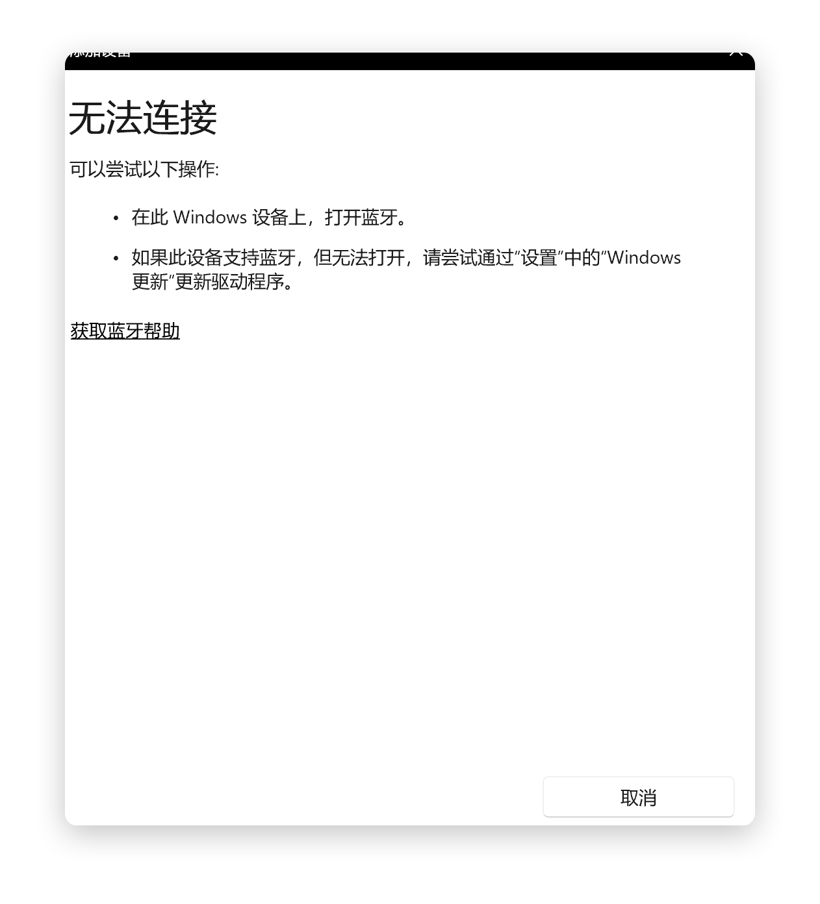
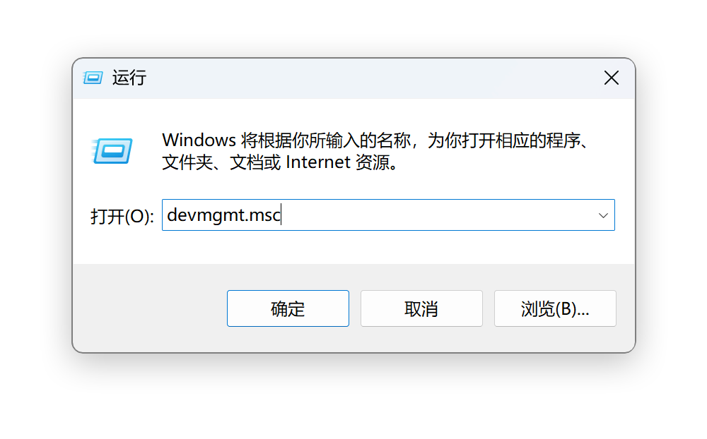
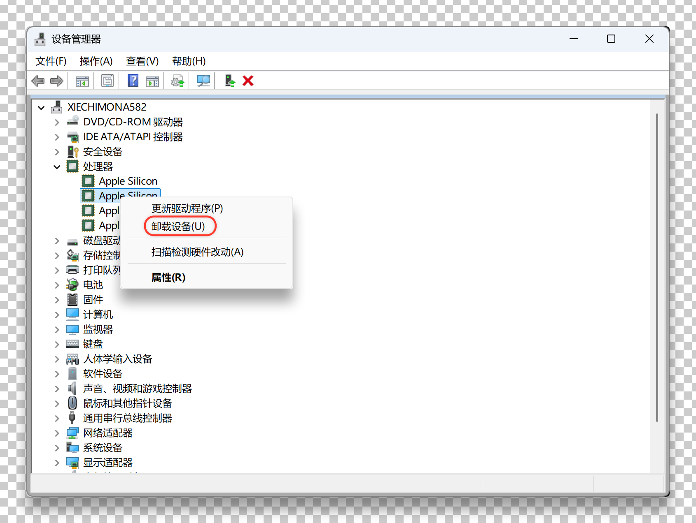
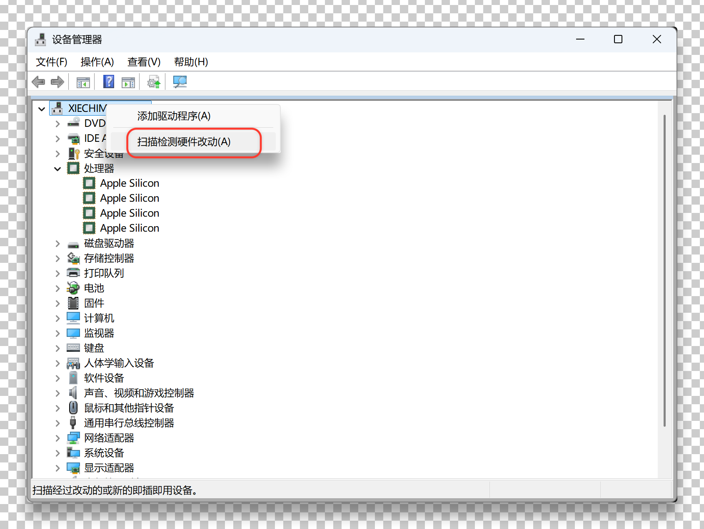

Windows 开机后蓝牙明明已开启，却一个设备都搜不到？别急着重装系统，用设备管理器卸载重装驱动就能解决，下面是亲测有效的三步。

## 修复步骤

### 1. 打开设备管理器

按下 `Win + R`，输入 `devmgmt.msc` 回车，打开设备管理器。

### 2. 卸载蓝牙设备

在列表中找到 `蓝牙`，右键点击你的蓝牙适配器，选择 `卸载设备`，确认后蓝牙模块会从列表中消失，这一步是让系统彻底释放旧驱动。

### 3. 重新扫描硬件

点击 `设备 > 扫描检测硬件改动`，系统会自动重装蓝牙驱动，待蓝牙图标重新出现后，再去蓝牙设置里扫描，设备就都回来了。

> 小技巧：若仍搜不到，可尝试重启蓝牙支持服务（`services.msc` 找到 `Bluetooth Support Service` 重启）或更新主板/无线网卡驱动。

## 参考

*   演示视频：https://v.douyin.com/Pm8-kNazFc0/
